The need to make systems and algorithms faster so as to make them more practical has been ever constant in the world of software engineering and cryptography at large, and lattice-based cryptography is not left out.

Number-theoretic Transform (NTT) was used in ML-KEM (Module-Lattice-Based Key-Encapsulation Mechanism), a lattice-based cryptographic algorithm used in establishing a shared secret key between two parties over a public channel. NTT is an analogue to the beautiful yet powerful Fast-fourier Transform (FTT).

This article is part one of two-part series  titled **Fast-fourier Transform (FTT), Number-theoretic Transform (NTT) and Lattice-based Cryptography**. The goal of this post is to take a deep dive into FFT and NTT while part two will explore how NTT is used in lattice-based algorithms like [ML-KEM](https://github.com/Godspower-Eze/pqc-ml-kem.rs) and [ML-DSA](https://csrc.nist.gov/pubs/fips/204/final).

As always, we are going to take a discovery approach, building up slowly from the familiar to the unfamiliar.

## Polynomial Multiplication

Given two polynomials $A$ and $B$ of degree 2 :
- $A = 3 - 4x + x^2$
- $B = 6 - 5x + x^2$

We are asked to multiply them. Easy, right?

- $C = A\ast B = (3 - 4x + x^2)(6 - 5x + x^2) = 3 * (6 - 5x + x^2) - 4x * (6 - 5x + x^2) + x^2 * (6 - 5x + x^2) = 18 + 39x + 29x^2 - 9x^3 + x^4$

Below is an implementation of this in Python:

```python
A = [3, -4, 1] # coefficients of A

B = [6, -5, 1] # coefficients of B

d = 2 # degree

C = [0 for _ in range((2 * d) + 1)]

for i in range(d + 1):
	for j in range(d + 1):
		C[i + j] = A[i] * B[j]
```

This algorithm takes $O(d^2)$ time. Is there a faster way to perform polynomial multiplication?

From the implementation above, you can tell that the polynomial is represented as a list of its *coefficients*. There are other representations.

According to the **uniqueness theorem,** a polynomial of degree at most $d$ is uniquely determined by its values at $d + 1$ **distinct** points. That is, a polynomial $f(x)$ of degree $d$ can be uniquely constructed by the points: $(x_0, f(x_0)), (x_1, f(x_1)),...,(x_d, f(x_d))$. Let's call this representation **point representation**.

A more general version of the uniqueness theorem states that a polynomial of degree at most $d$ is uniquely determined by its values at *at least* $d + 1$ **distinct** points. That means we could uniquely represent our polynomial using more than $d + 1$ points.

Now, let's represent our polynomials using the point representation, using the values $x = -5, -4, -3, -2, -1$. Therefore, our polynomial can be represented as follows:


| $x$  | $A(x)$ | $B(x)$ | $(x, A(x))$ | $(x, B(x))$ |
| ---- | ------ | ------ | ----------- | ----------- |
| $-5$ | $48$   | $56$   | $(-5, 48)$  | $(-5, 56)$  |
| $-4$ | $35$   | $42$   | $(-4, 35)$  | $(-4, 42)$  |
| $-3$ | $24$   | $30$   | $(-3, 24)$  | $(-3, 30)$  |
| $-2$ | $15$   | $20$   | $(-2, 15)$  | $(-2, 20)$  |
| $-1$ | $8$    | $12$   | $(-1, 8)$   | $(-1, 12)$  |

Now, on to the interesting part. It turns out that $C(x_i) =A(x_i) \ast B(x_i)$. That is, if you multiply the evaluation $A(x_i)$ by the evaluation $B(x_i)$, you get the evaluation $C(x_i)$. See the table below:

| $x$  | $A(x)$ | $B(x)$ | $(x, A(x))$ | $(x, B(x))$ | $C(x) = A(x) * B(x)$ | $(x, C(x))$  |
| ---- | ------ | ------ | ----------- | ----------- | -------------------- | ------------ |
| $-5$ | $48$   | $56$   | $(-5, 48)$  | $(-5, 56)$  | $2688$               | $(-5, 2688)$ |
| $-4$ | $35$   | $42$   | $(-4, 35)$  | $(-4, 42)$  | $1470$               | $(-4, 1470)$ |
| $-3$ | $24$   | $30$   | $(-3, 24)$  | $(-3, 30)$  | $720$                | $(-3, 720)$  |
| $-2$ | $15$   | $20$   | $(-2, 15)$  | $(-2, 20)$  | $300$                | $(-2, 300)$  |
| $-1$ | $8$    | $12$   | $(-1, 8)$   | $(-1, 12)$  | $96$                 | $(-1, 96)$   |

This means that the points $(x, C(x))$ uniquely represents the polynomial $C = 18 + 39x + 29x^2 - 9x^3 + x^4$.

What does this all mean? We just achieved an $O(d)$ time polynomial multiplication by using the point representation form of the polynomials.

Does that mean we just achieved $O(d)$ for polynomial multiplication? Not really. 

Given two polynomials $f(x)$ and $g(x)$ of the form: $a_0 + a_1x + a_2x^2 + \cdots + a_{d}x^{d}$, here's the full process:

1. **Convert from coefficient to point representation**: we pick a set of $x$ values and evaluate the polynomials at those points thereby converting the polynomials to the point representation.

   That is, we pick $x_i = \lbrace x_0, x_1, ... ,x_d \rbrace$. Then, we compute $f(x_i) = \lbrace f(x_0), f(x_1),...,f(x_d) \rbrace$ and $g(x_i) = \lbrace g(x_0), g(x_1),...,g(x_d) \rbrace$.

   There's a way of expressing this in a matrix form:

   $$ \begin{aligned} V &= \begin{bmatrix}x_0^0 & x_0^1 & x_0^2 & \cdots & x_0^{n} \\\\ x_1^0 & x_1^1 & x_1^2 & \cdots & x_1^{n} \\\\ x_2^0 & x_2^1 & x_2^2 & \cdots & x_2^{n} \\\\[0.3em]\vdots & \vdots & \vdots & \ddots & \vdots \\\\[0.3em]x_n^0 & x^1_{n} & x_{n}^2 & \cdots & x_{n}^{n}\end{bmatrix} \\\\[2pt] &= \begin{bmatrix}1 & x_0^1 & x_0^2 & \cdots & x_0^{n} \\\\ 1 & x_1^1 & x_1^2 & \cdots & x_1^{n} \\\\ 1 & x_2^1 & x_2^2 & \cdots & x_2^{n} \\\\[0.3em]\vdots & \vdots & \vdots & \ddots & \vdots \\\\[0.3em] 1 & x^1_{n} & x_{n}^2 & \cdots & x_{n}^{n}\end{bmatrix} \end{aligned} $$

   $$a = \begin{bmatrix}a_0 \\\\ a_1 \\\\ a_2 \\\\ \vdots \\\\ a_n\end{bmatrix}$$

   $$\begin{aligned} Va &= \begin{bmatrix}a_0x_0^0 + a_1x_0^1 + a_2x_0^2 + \cdots + a_nx_0^n \\\\ a_0x_1^0 + a_1x_1^1 + a_2x_1^2 + \cdots + a_nx_1^n \\\\ a_0x_2^0 + a_1x_2^1 + a_2x_2^2 + \cdots + a_nx_2^n \\\\ \vdots \\\\ a_0x_n^0 + a_1x_n^1 + a_2x_n^2 + \cdots + a_nx_n^n \end{bmatrix} \\\\[2pt] &= \begin{bmatrix} f(x_0) \\\\ f(x_1) \\\\ f(x_2) \\\\ \vdots \\\\ f(x_n) \end{bmatrix} \end{aligned} $$

   $$ Va = f(x_i)$$

   where $n$ is at least $d$, $V$ is the matrix of $x_i$ and their powers, $a$ is a vector of coefficients and $f(x_i)$ are the evaluations. $V$ is called the **vandermonde** matrix.

   This shows that the process of evaluating the polynomial $f(x_i)$ is a *matrix-vector multiplication* which is an $O(n^2)$ operation. $f(x_i)$ can also be written as follows: $$f(x_i) = \sum^{n}_{j=0}a_jx^j_i$$

   Keep this in mind, as this formula for expressing $f(x_i)$ is important in understanding FFT later.

   Using $A(x)$ as an example, choosing $n = 4$ and $x =\lbrace x_0, x_1, x_2, x_3, x_4 \rbrace= \lbrace-5, -4, -3, -2, -1 \rbrace$, we have the following:

   $$\begin{aligned} V &= \begin{bmatrix}1 & x_0 & x_0^2 & x_0^3 & x_0^4 \\\\ 1 & x_1 & x_1^2 & x_1^3 & x_1^4 \\\\ 1 & x_2 & x_2^2 & x_2^3 & x_2^4 \\\\ 1 & x_3 & x_3^2 & x_3^3 & x_3^4 \\\\ 1 & x_4 & x_4^2 & x_4^3 & x_4^4 \end{bmatrix} \\\\[2pt] &= \begin{bmatrix}1 & -5 & -5^2 & -5^3 & -5^4 \\\\ 1 & -4 & -4^2 & -4^3 & -4^4 \\\\ 1 & -3 & -3^2 & -3^3 & -3^4 \\\\ 1 & -2 & -2^2 & -2^3 & -2^4 \\\\ 1 & -1 & -1^2 & -1^3 & -1^4 \end{bmatrix} \\\\[2pt] &= \begin{bmatrix}1 & -5 & 25 & -125 & 625 \\\\ 1 & -4 & 16 & -64 & 256 \\\\1 & -3 & 9 & -27 & 81 \\\\ 1 & -2 & 4 & -8 & 16 \\\\ 1 & -1 & 1 & -1 & 1\end{bmatrix} \end{aligned}$$

   $$a = \begin{bmatrix}a_0 \\\\ a_1 \\\\ a_2 \\\\ a_3 \\\\ a_4\end{bmatrix} = \begin{bmatrix}3 \\\\ -4 \\\\ 1 \\\\ 0 \\\\ 0\end{bmatrix}$$

   $$Va = A(x_i) = \begin{bmatrix}A(x_0) \\\\ A(x_1) \\\\ A(x_2) \\\\ A(x_3) \\\\ A(x_4)\end{bmatrix} = \begin{bmatrix}48 \\\\ 35 \\\\ 24 \\\\ 15 \\\\ 8 \end{bmatrix}$$
   
3. **Multiply pairwise** (*i.e* $C(x) = A(x) \ast B(x)$). This runs in $O(n)$ time.
4. **Convert back from the point represention to the coefficient representation**: This is the reverse of step one. We want to find $a$, given $V$ and $f(x_i)$. To compute this, we find the **inverse of $V$** denoted by $V^{-1}$ and multiply by $f(x_i)$. That is:

   $$Va = f(x_i)$$

   $$V^{-1}Va = V^{-1}f(x_i)$$

   $$a = V^{-1}f(x_i)$$

   Using $A(x)$ as an example:

   $$V^{-1} = \begin{bmatrix}1 & -5 & 10 & -10 & 5 \\\\ 25/12 & -61/6 & 39/2 & -107/6 & 77/12 \\\\ 35/24 & -41/6 & 49/4 & -59/6 & 71/24 \\\\ 5/12 & -11/6 & 3 & -13/6 & 7/12 \\\\ 1/24 & -1/6 & 1/4 & -1/6 & 1/24 \end{bmatrix}$$

   $$A(x_i) = \begin{bmatrix}48 \\\\ 35 \\\\ 24 \\\\ 15 \\\\ 8 \end{bmatrix}$$

   $$a = V^{-1}A(x_i) = \begin{bmatrix}1 & -5 & 10 & -10 & 5 \\\\ 25/12 & -61/6 & 39/2 & -107/6 & 77/12 \\\\ 35/24 & -41/6 & 49/4 & -59/6 & 71/24 \\\\ 5/12 & -11/6 & 3 & -13/6 & 7/12 \\\\ 1/24 & -1/6 & 1/4 & -1/6 & 1/24 \end{bmatrix} \begin{bmatrix}48 \\\\ 35 \\\\ 24 \\\\ 15 \\\\ 8 \end{bmatrix} = \begin{bmatrix}3 \\\\ -4 \\\\ 1 \\\\ 0 \\\\ 0\end{bmatrix}$$

   The best version of this algorithm runs in $O(n^2)$ time.

In total, this process still takes $O(n^2)$ time. 

But, what if there was actually a faster way? A way that allows us to do polynomial multiplication in less than $O(n^2)$. 

Fast-fourier Transform (FFT) gives us that. FFT allows us to do step one and step three in $O(n\log n)$ time; making the whole process $O(n \log n)$ time.

To understand FFT, we need to understand the concept of **complex numbers** and **roots of unity**

## Complex Numbers and Roots of Unity

The magic of FFT is based on the beautiful concept of roots of unity but that in turn is only made possible by the unique properties of complex numbers. So, here's a deep dive on complex numbers and roots of unity.

Given the polynomial $P(x) = 1 + x + x^2$, find the roots(*i.e*, the values of $x$ for which $P(x) = 0$) of the polynomial. The simple answer is the roots does not exist.

Using the quadratic formula $x = \dfrac{-b \pm \sqrt{b^2 - 4ac}}{2a}$, let's solve anyways:
- $a = 1$, $b = 1$ and $c = 1$
- $x = \dfrac{-1 \pm \sqrt{1^2 - 4(1)(1)}}{2(1)} = \dfrac{-1 \pm \sqrt{-3}}{2} = \dfrac{-1}{2} \pm \dfrac{\sqrt{-3}}{2}$  
Therefore, the roots of $P(x)$ are $\dfrac{-1}{2} + \dfrac{\sqrt{-3}}{2}$ and $\dfrac{-1}{2} - \dfrac{\sqrt{-3}}{2}$.

But, we previously said the polynomial didn't have a root. How come we got two roots? The answer lies in the fact that from the beginning we have been dealing with real numbers $\mathbb{R}$ and the roots $\dfrac{-1}{2} + \dfrac{\sqrt{-3}}{2}$ and $\dfrac{-1}{2} - \dfrac{\sqrt{-3}}{2}$ are not real numbers. Therefore, the roots does not exist in real space. 

If the roots are not real numbers, then what are they? They are complex numbers!

Let's further simplify the roots. $\sqrt{-3}$ can be written $\sqrt{3} * \sqrt{-1}$. But, we know that $\sqrt{-1}$ is impossible to find. It has a special name, the *imaginary unit* denoted as $\mathrm{i}$.

We can rewrite our roots as follows: $\dfrac{-1}{2} + \dfrac{\sqrt{3}\mathrm{i}}{2}$ and $\dfrac{-1}{2} - \dfrac{\sqrt{3}\mathrm{i}}{2}$. Therefore, a complex number $\mathbb{C}$ is a number of the form: $a + b\mathrm{i}$ where $a$ and $b$ are real numbers and $\mathrm{i}$ is the imaginary unit. $a$ is called the *real part* and $b\mathrm{i}$ is called the *imaginary part*. This form of representing a complex number is called the *rectangular form*. You'll see why soon.

The set of real numbers $\mathbb{R}$ is a proper subset of the complex numbers $\mathbb{C}$ (*i.e*, $\mathbb{R} \subset \mathbb{C}$). Every real number can be written as a complex number where $b = 0$ (*e.g* $5 = 5 + 0\mathrm{i}$).

One way to describe a real number is as follows: a real number is any number that can be located on the infinite number line. That means, real numbers are represented on a number line as shown below.


    
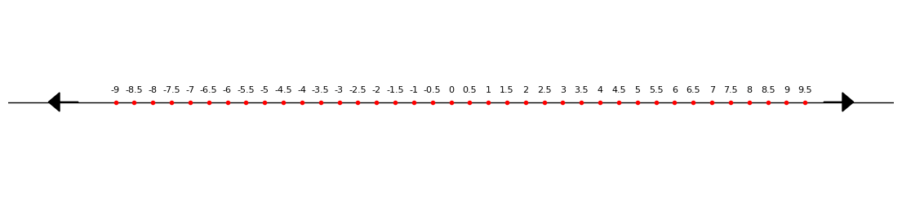
    


How do we represent a complex number? The number line would have been a good option but it would only be able to take the real part. We need diagram that allows us to show both the real part and the imaginary part. That's where the **Argand diagram** comes in!

The Argand diagram is two dimensional plane with the real part on the horinzontal line(x-axis) and the imaginary part on the vertical line (y-axis). 

For example, the complex number $2 + 3\mathrm{i}$ is represented as follows:


    
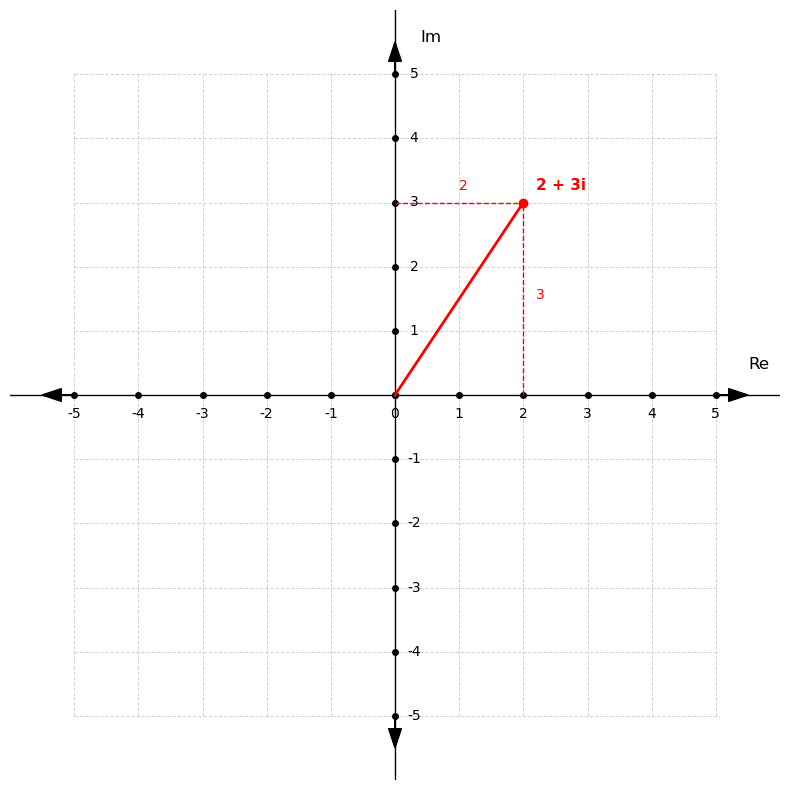
    


Notice how the dotted lines from $2$ and $3$ forms a rectangle. That's why the form $a + b\mathrm{i}$ is called the *rectangular form*.

Imagine we were given the diagram with just the line from the origin as shown below. Would we be able to identify the complex number?


    
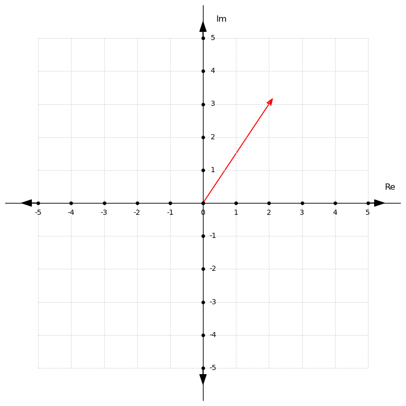
    


Notice how the angle forms a *right angle triangle*. The diagram below should help.


    
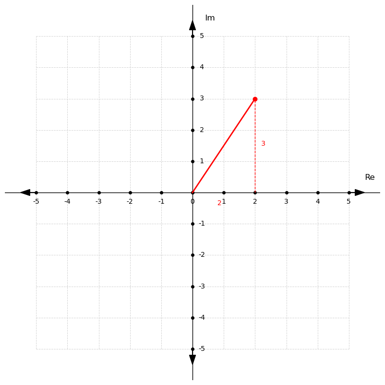
    


What do we know about right angle triangles?

According to the **Pythagoras Theorem**, in a right angled triangle, the square of the length of the hypotenuse(the side opposite the right angle) is equal to the sum of the squares of the lengths of the other two sides(*opposite* and *adjacent*). Mathematically, if a right-angled triangle has sides $a$ and $b$, and hypotenuse $c$, then: $c^2 = a^2 + b^2$.

Having known this; let's adjust out diagram.


    
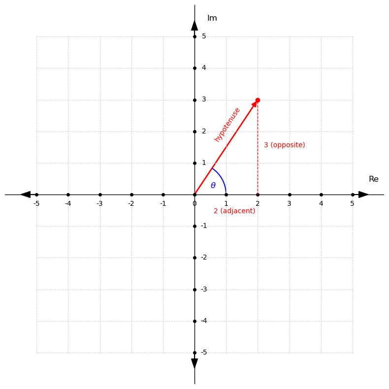
    


From the diagram, we can see that we have two unknowns, the hypotenuse which will be denoted as $r$ and the angle $\theta$.

From pythagoras theorem, we know $r^2 = a^2 + b^2$. Therefore:$$r^2 = 2^2 + 3^2 = 4 + 9 = 13$$
$$r = \sqrt{13}$$

Now we know $r$, how do we find $\theta$? Do you remember the acronym SOHCAHTOA from high school? This implies:
$$\sin\theta = \dfrac{\mathrm{opposite}}{\mathrm{hypotenuse}} = \dfrac{b}{r},\qquad b = r\sin\theta$$
$$\cos\theta = \dfrac{\mathrm{adjacent}}{\mathrm{hypotenuse}} = \dfrac{a}{r},\qquad a = r\cos\theta$$
$$\tan\theta = \dfrac{\mathrm{opposite}}{\mathrm{adjacent}} = \dfrac{b}{a}, \qquad \theta = \tan^{-1}(\dfrac{b}{a})$$

From this, we can deduce that: $a + b\mathrm{i} = r\cos\theta + \mathrm{i}r\sin\theta = r(\cos\theta + \mathrm{i}\sin\theta)$. This form of representing a complex number is called the *polar form*.

Now we find $\theta$ using $\tan^{-1}(\dfrac{b}{a})$, $\quad \theta = \tan^{-1}(\dfrac{3}{2}) = 0.983$ radians.

We have that $r = \sqrt{13}$ and $\theta = 0.983$. Given these two values, we represent the complex number $2 + 3\mathrm{i}$ as $\sqrt{13}(\cos(0.983) + \mathrm{i}\sin(0.983))$. $0.983$ radians is $56.3^\circ$ in degrees and it's better for visualization as shown below.

The polar representation might not look like the simplest way to express a complex number but it's going to help us understand roots of unity.

Formally, $r$ is distance from the point of the complex number to the origin and it is called the *modulus* or the *absolute value*. $\theta$ is called the *argument* of the complex number and it is the angle that the modulus $r$ makes from the positive real axis.


    
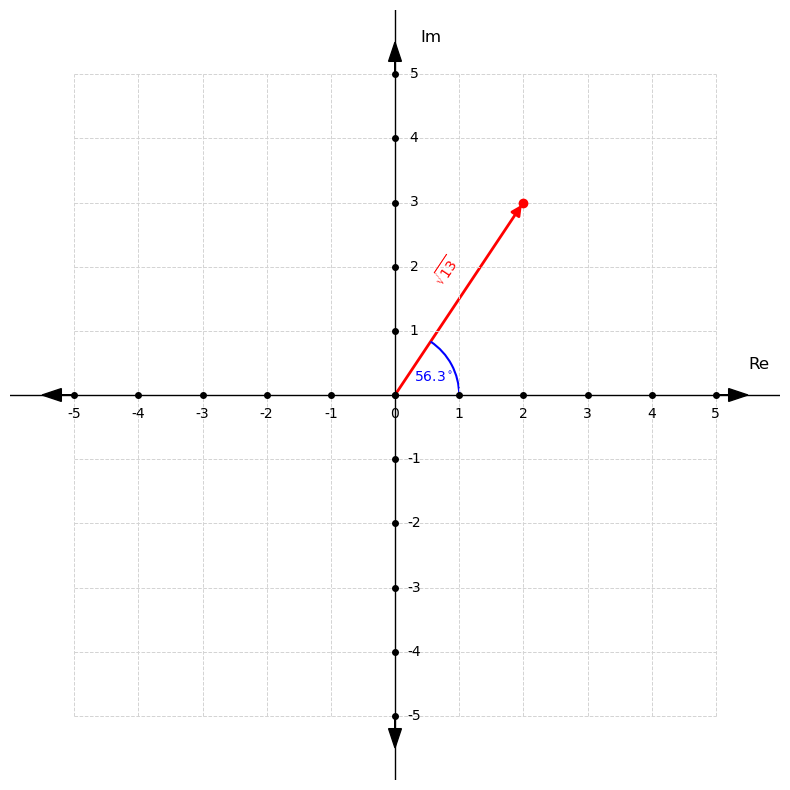
    


Let's look at another representation of complex numbers.

Have you ever wondered how calculators computed trignometric functions like $\sin(x)$, $\cos(x)$ and the exponential function $e^x$? The answer lies in approximation using power series.

$\cos(x)$ and $\sin(x)$ are approximated using the power series $1\ -\frac{x^{2}}{2!} + \frac{x^{4}}{4!} - \frac{x^{6}}{6!} + \frac{x^{8}}{8!} + \cdots$ and $x\ -\frac{x^{3}}{3!} + \frac{x^{5}}{5!} - \frac{x^{7}}{7!} + \frac{x^{9}}{9!} + \cdots$ respectively. I urge you to verify this using a graph(*i.e* compare their graphs against each other while extending the series).

Let's substitute $\theta$ for $x$:

$$\cos(\theta) = 1\ - \frac{\theta^{2}}{2!} + \frac{\theta^{4}}{4!} - \frac{\theta^{6}}{6!} + \frac{\theta^{8}}{8!} + \cdots$$

$$\sin(\theta) = \theta\ - \frac{\theta^{3}}{3!} + \frac{\theta^{5}}{5!} - \frac{\theta^{7}}{7!} + \frac{\theta^{9}}{9!} + \cdots$$

Now, let's subsitute this approximation into the polar form:

$$\begin{aligned} \cos\theta + \mathrm{i}\sin\theta &= (1\ - \frac{\theta^{2}}{2!} + \frac{\theta^{4}}{4!} - \frac{\theta^{6}}{6!} + \frac{\theta^{8}}{8!} + \cdots) + \mathrm{i}(\theta\ - \frac{\theta^{3}}{3!} + \frac{\theta^{5}}{5!} - \frac{\theta^{7}}{7!} + \frac{\theta^{9}}{9!} + \cdots) \\\\[6pt]&= (1\ - \frac{\theta^{2}}{2!} + \frac{\theta^{4}}{4!} - \frac{\theta^{6}}{6!} + \frac{\theta^{8}}{8!} + \cdots) + (\mathrm{i}\theta\ - \mathrm{i}\frac{\theta^{3}}{3!} + \mathrm{i}\frac{\theta^{5}}{5!} - \mathrm{i}\frac{\theta^{7}}{7!} + \mathrm{i}\frac{\theta^{9}}{9!} + \cdots) \\\\[6pt] &= 1\ + \mathrm{i}\theta - \frac{\theta^{2}}{2!} - \mathrm{i}\frac{\theta^{3}}{3!} + \frac{\theta^{4}}{4!} + \mathrm{i}\frac{\theta^{5}}{5!} - \frac{\theta^{6}}{6!} - \mathrm{i}\frac{\theta^{7}}{7!} + \frac{\theta^{8}}{8!} + \mathrm{i}\frac{\theta^{9}}{9!} + \cdots \end{aligned} $$

Let's look at that of the exponential function $e^x$. The power series for $e^x$ as follows:  $$1 + x + \frac{x^2}{2!} + \frac{x^3}{3!} + \frac{x^4}{4!} + \frac{x^5}{5!} + \frac{x^6}{6!} + \frac{x^7}{7!} + \frac{x^8}{8!} + \frac{x^9}{9!} \cdots$$

Let's substitute $\mathrm{i}\theta$ for $x$: $$ e^{\mathrm{i}\theta} = 1 + \mathrm{i}\theta + \frac{(\mathrm{i}\theta)^2}{2!} + \frac{(\mathrm{i}\theta)^3}{3!} + \frac{(\mathrm{i}\theta)^4}{4!} + \frac{(\mathrm{i}\theta)^5}{5!} + \frac{(\mathrm{i}\theta)^6}{6!} + \frac{(\mathrm{i}\theta)^7}{7!} + \frac{(\mathrm{i}\theta)^8}{8!} + \frac{(\mathrm{i}\theta)^9}{9!} + \cdots$$

We will compute the powers of $(\mathrm{i}\theta)$. From indices we know that $(\mathrm{i}\theta)^n = \theta^n\mathrm{i}^n$. Let's focus on $\mathrm{i}^n$:
- $\mathrm{i}^1 = \mathrm{i}$
- $\mathrm{i}^2 = \sqrt{-1} \ast \sqrt{-1} = -1$
- $\mathrm{i}^3 = \sqrt{-1} \ast \sqrt{-1} \ast \sqrt{-1} = -1 \ast \sqrt{-1} =  -\mathrm{i}$
- $\mathrm{i}^4 = \sqrt{-1} \ast \sqrt{-1} \ast \sqrt{-1} \ast \sqrt{-1} = -1 \ast -1 = 1$
- $\mathrm{i}^5 = \mathrm{i}$
- $\mathrm{i}^6 = -1$
- $\mathrm{i}^7 = -\mathrm{i}$
- $\mathrm{i}^8 = 1$
- $\mathrm{i}^9 = \mathrm{i}$

Do you see the pattern? The values are cyclic in nature; $\mathrm{i}$ to $1$, it repeats and continues like that. We will come back to this but for now let's go back to computing $e^{\mathrm{i}\theta}$. It now becomes: $$e^{\mathrm{i}\theta} = 1 + \mathrm{i}\theta - \frac{\theta^2}{2!} - \mathrm{i}\frac{\theta^3}{3!} + \frac{\theta^4}{4!} + \mathrm{i}\frac{\theta^5}{5!} - \frac{\theta^6}{6!} - \mathrm{i}\frac{\theta^7}{7!} + \frac{\theta^8}{8!} + \mathrm{i}\frac{\theta^9}{9!} + \cdots$$

From this we can see that $e^{\mathrm{i}\theta} = \cos(\theta) + \mathrm{i}\sin(\theta)$. Therefore, we have our third representation, the *exponential form*: $re^{\mathrm{i}\theta}$.

In summary, we have:
- rectangular form: $a + b\mathrm{i}$
- polar form: $r(\cos\theta + \mathrm{i}\sin\theta)$
- exponential form: $re^{\mathrm{i}\theta}$

Soon, you will see why exponential and polar form are best suited for understanding and working with roots of unity.

Now, back to where this it all started: finding the roots of the polynomial $P(x) = 1 + x + x^2$. We saw that the roots are $\dfrac{-1}{2} + \dfrac{\sqrt{3}\mathrm{i}}{2}$ and $\dfrac{-1}{2} - \dfrac{\sqrt{3}\mathrm{i}}{2}$.

Let's represent them using the argand diagram.


    
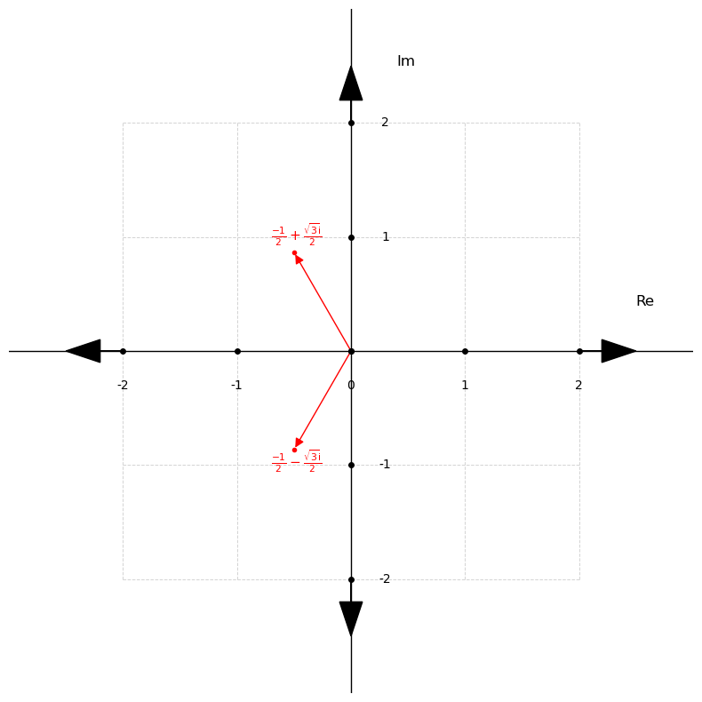
    


Let's find the modulus $r$ and the argument $\theta$ of these roots:
- For $\dfrac{-1}{2} + \dfrac{\sqrt{3}\mathrm{i}}{2}$:
  - finding $r$: $r^2 = a^2 + b^2$, $\quad a = \dfrac{-1}{2}$, $\quad b =  \dfrac{\sqrt{3}}{2}$, $\quad r^2 = (\dfrac{-1}{2})^2 + (\dfrac{\sqrt{3}}{2})^2 = \dfrac{1}{4} + \dfrac{3}{4} = \dfrac{4}{4} = 1$, $\quad r = 1$
  - finding $\theta$: $\theta = \tan^{-1}(\dfrac{b}{a}) = \tan^{-1}(\dfrac{\dfrac{\sqrt{3}}{2}}{\dfrac{-1}{2}}) = \tan^{-1}(\dfrac{\sqrt{3}}{-1}) = \tan^{-1}(-\sqrt{3}) = -60^\circ$ or $-\dfrac{\pi}{3}$
- For $\dfrac{-1}{2} - \dfrac{\sqrt{3}\mathrm{i}}{2}$:
  - finding $r$: $r^2 = a^2 + b^2$, $\quad a = \dfrac{-1}{2}$, $\quad b =  \dfrac{-\sqrt{3}}{2}$, $\quad r^2 = (\dfrac{-1}{2})^2 + (\dfrac{-\sqrt{3}}{2})^2 = \dfrac{1}{4} + \dfrac{3}{4} = \dfrac{4}{4} = 1$, $\quad r = 1$
  - finding $\theta$: $\theta = \tan^{-1}(\dfrac{b}{a}) = \tan^{-1}(\dfrac{\dfrac{-\sqrt{3}}{2}}{\dfrac{-1}{2}}) = \tan^{-1}(\dfrac{-\sqrt{3}}{-1}) = \tan^{-1}(\sqrt{3}) = 60^\circ$ or $\dfrac{\pi}{3}$

Let's show our $r$ and $\theta$ values to our diagram.


    
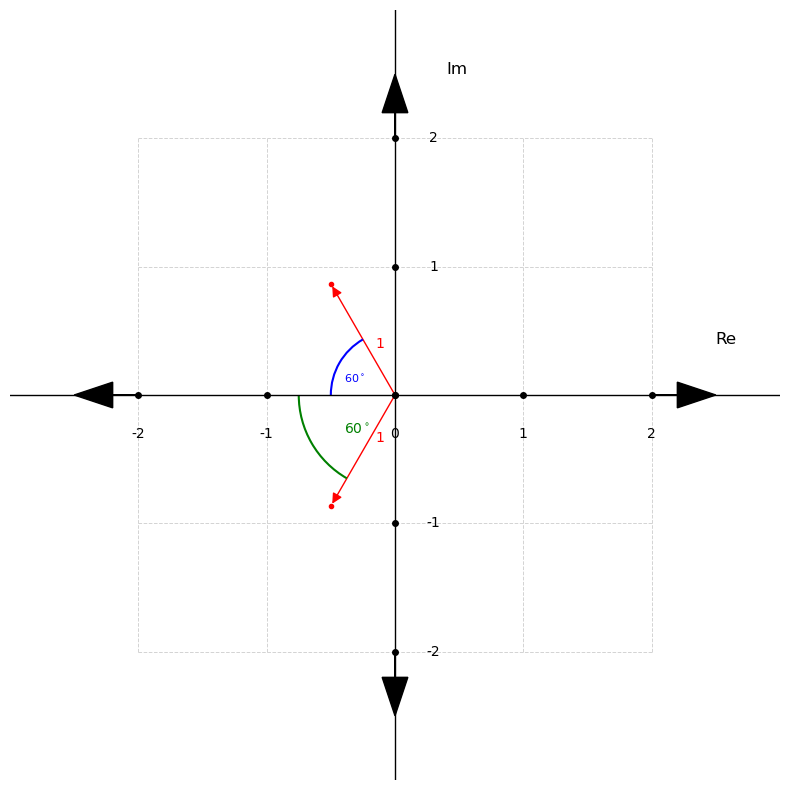
    


This is our argand diagram represented in respect to $r$ and $\theta$. But, it's not exactly correct.

Recall that the argument $\theta$ is "the angle that the modulus makes from the positive real axis". The key phrase is *from the positive real axis*.

Let's show this:


    
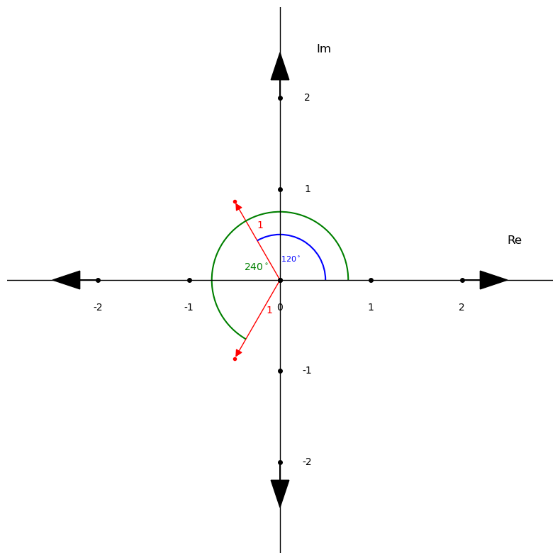
    


As you can see, $\theta$ for $\dfrac{-1}{2} + \dfrac{\sqrt{3}\mathrm{i}}{2}$ becomes $120^\circ$ or $\dfrac{2\pi}{3}$ and $\theta$ for $\dfrac{-1}{2} - \dfrac{\sqrt{3}\mathrm{i}}{2}$ becomes $240^\circ$ or $\dfrac{4\pi}{3}$. 

In exponential form, this will be written as $e^{2\pi\mathrm{i}/3}$ and $e^{4\pi\mathrm{i}/3}$ respectively as $r = 1$.

This also helps us see the argument $\theta$ not just as angle but a *rotation* from the positive real axis and this is the mental model we need to understand roots of unity.

Let's do a quick experiment: we are going take the roots individually and compute their powers up to the third power. Then, we are going to see what happens in the argand diagram.

Starting with $e^{2\pi\mathrm{i}/3}$:

- We compute the zero power: $(e^{2\pi\mathrm{i}/3})^0 = e^{0} = 1$


    

    


- The first power: $(e^{2\pi\mathrm{i}/3})^1 = e^{2\pi\mathrm{i}/3}$


    
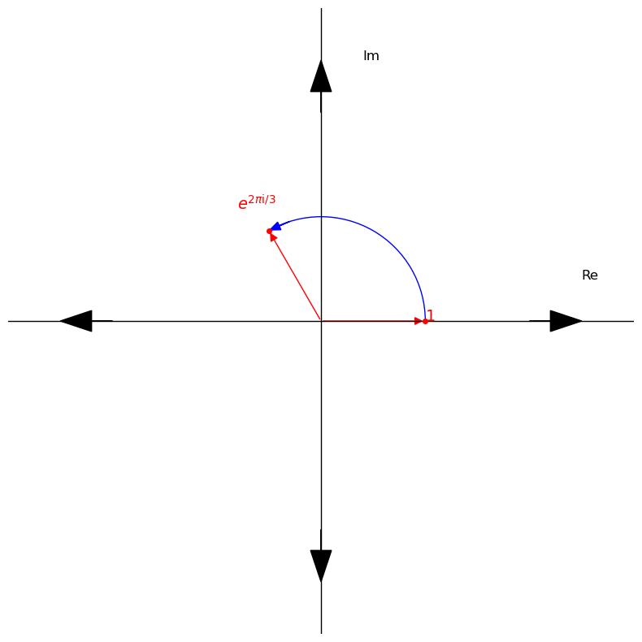
    


- The second power $(e^{2\pi\mathrm{i}/3})^2 = e^{4\pi\mathrm{i}/3}$


    

    


- The third power $(e^{2\pi\mathrm{i}/3})^3 = e^{2\pi\mathrm{i}}$


    
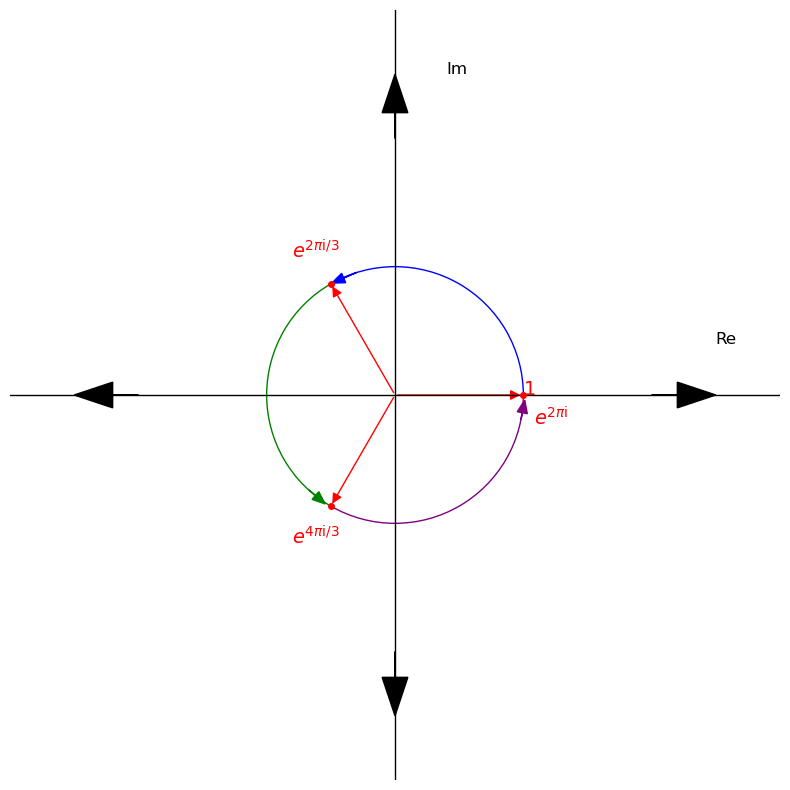
    


-----

Then, for $e^{4\pi\mathrm{i}/3}$:

- We compute the zero power: $(e^{4\pi\mathrm{i}/3})^0 = e^0 = 1$


    
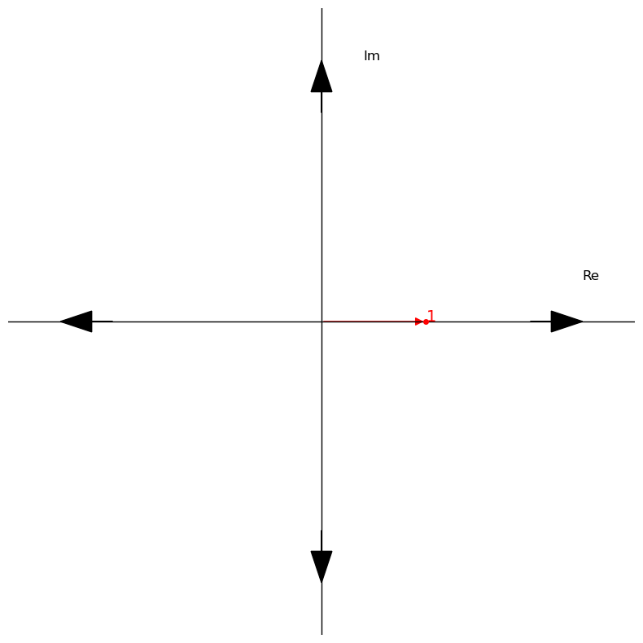
    


- The first power: $(e^{4\pi\mathrm{i}/3})^1 = e^{4\pi\mathrm{i}/3}$


    
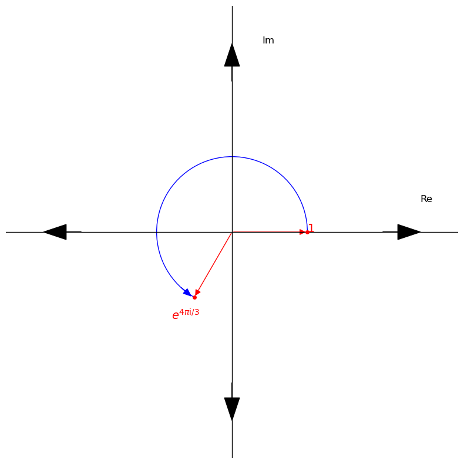
    


- The second power: $(e^{4\pi\mathrm{i}/3})^2 = e^{8\pi\mathrm{i}/3}$


    
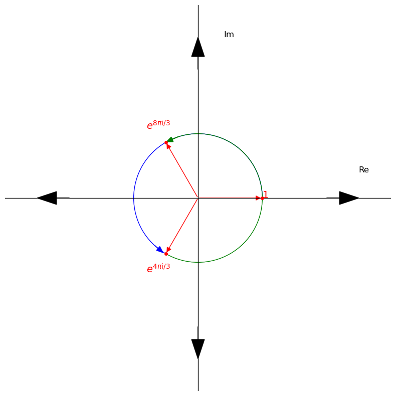
    


- The third power: $(e^{4\pi\mathrm{i}/3})^3 = e^{4\pi\mathrm{i}}$


    
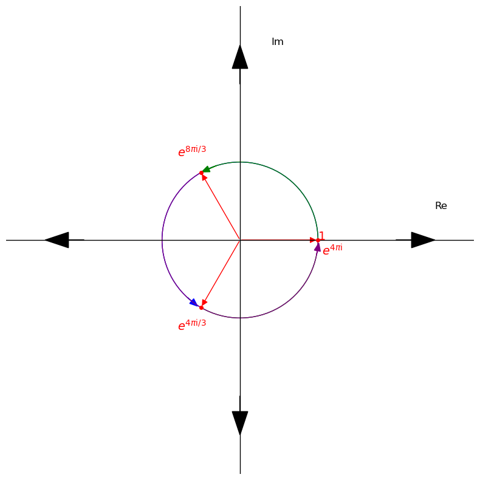
    


----

What do you notice?

The powers cycles back to $1$ at the third power. If we continued this cycle, you would notice that it doesn't just cycle back to $1$ at the third power but every power that's a multiple of $3$. I urge you to try this out.

Let's try this again for another polynomial.

Given the polynomial $G(x) = x^4 - 1$, let's the find the roots.

We get that:

- $G(x) = x^4 - 1 = (x^2 - 1)(x^2 + 1) = (x - 1)(x + 1)(x^2 + 1)$

Setting them to zero, we have that:
- $(x - 1) = 0$, $x = 1$
- $(x + 1) = 0$, $x = -1$
- $(x^2 + 1) = 0$, $x^2 = -1$, $x = \pm\sqrt{-1} = \pm\mathrm{i}$

Therefore, the roots of $G(x)$ are $1$, $-1$, $-\mathrm{i}$ and $\mathrm{i}$

Let's show them on the argand diagram.


    
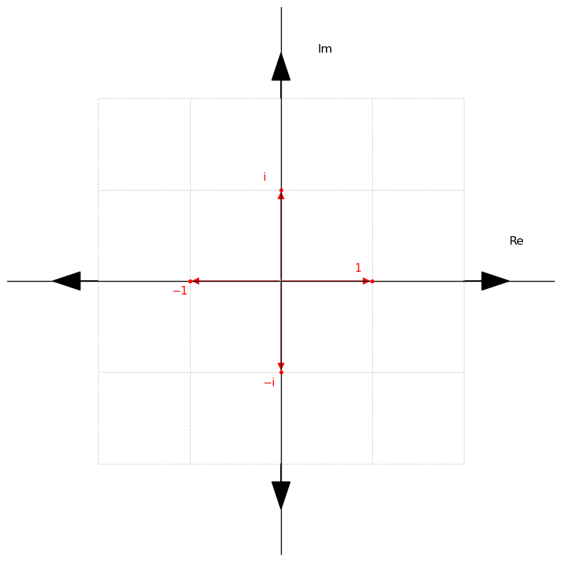
    


----

Let's compute the modulus $r$ and argument $\theta$ for each of them.

- For $1$:
  - finding $r$: $r^2 = a^2 + b^2$, $\quad a = 1$, $\quad b = 0$, $\quad r^2 = 1^2 + 0^2 = 1$, $\quad r = 1$
  - finding $\theta$: $\theta = \tan^{-1}(\dfrac{b}{a}) = \tan^{-1}(\dfrac{0}{1}) = \tan^{-1}(0) = 0 = 0^\circ$ or $0\pi$
- For $-1$:
  - finding $r$: $r^2 = a^2 + b^2$, $\quad a = -1$, $\quad b = 0$, $\quad r^2 = -1^2 + 0^2 = 1$, $\quad r = 1$
  - finding $\theta$: $\theta = \tan^{-1}(\dfrac{b}{a}) = \tan^{-1}(\dfrac{0}{-1}) = \tan^{-1}(0) = 0 = 0^\circ$. $0^\circ$ from the positive x-axis is $180^\circ$ so $\theta = 180^\circ$ or $\pi$
- For $\mathrm{i}$:
  - finding $r$: $r^2 = a^2 + b^2$, $\quad a = 0$, $\quad b = 1$, $\quad r^2 = 0^2 + 1^2 = 1$, $\quad r = 1$
  - finding $\theta$: $\theta = \tan^{-1}(\dfrac{b}{a}) = \tan^{-1}(\dfrac{1}{0}) = 90^\circ$ or $\dfrac{\pi}{2}$. This looks like we are dividing 1 by 0 but trust me that's not the case. I will leave you to verify this yourself.
- For $-\mathrm{i}$:
  - finding $r$: $r^2 = a^2 + b^2$, $\quad a = 0$, $\quad b = -1$, $\quad r^2 = 0^2 + (-1)^2 = 1$, $\quad r = 1$
  - finding $\theta$: $\theta = \tan^{-1}(\dfrac{b}{a}) = \tan^{-1}(\dfrac{-1}{0}) = \tan^{-1}(0) = -90^\circ$. $-90^\circ$ from the positive x-axis is $270$ so $\theta = 270^\circ$ or $\dfrac{3\pi}{2}$

Converting them to exponential form, being that $r = 1$ for all roots, we have that:
-  $1 = e^{0\mathrm{i}} = e^0$
-  $-1 = e^{\pi\mathrm{i}}$
-  $\mathrm{i} = e^{\pi\mathrm{i}/{2}}$
-  $-\mathrm{i} = e^{3\pi\mathrm{i}/{2}}$

Now, let's compute the powers of each root up to the fourth power.

Starting with $e^0$:

- We compute the zero power $(e^0)^0 = e^0$. Notice that all the powers are equal as $(e^0)^0 = (e^0)^1 = (e^0)^2 = (e^0)^3 = (e^0)^4 = e^0$ so we have just one argand diagram showing the point without rotation.


    

    


-----

For $e^{\pi\mathrm{i}}$:
- We compute the zero power: $(e^{\pi\mathrm{i}})^0 = e^0$


    
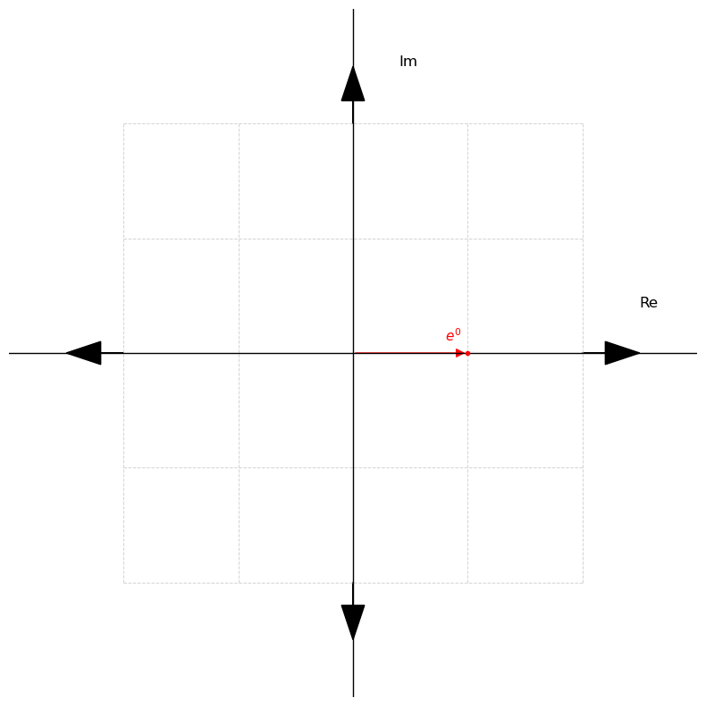
    


- The first power: $(e^{\pi\mathrm{i}})^1 = e^{\pi\mathrm{i}}$


    
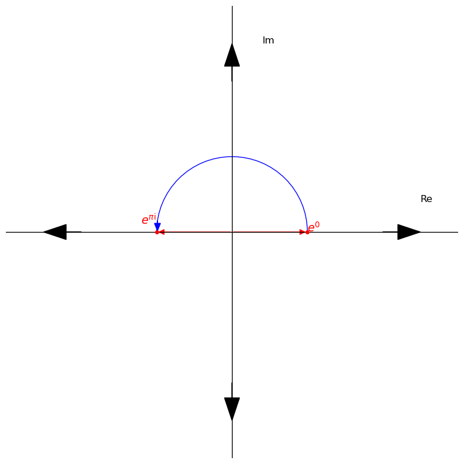
    


- The second power: $(e^{\pi\mathrm{i}})^2 = e^{2\pi\mathrm{i}}$


    
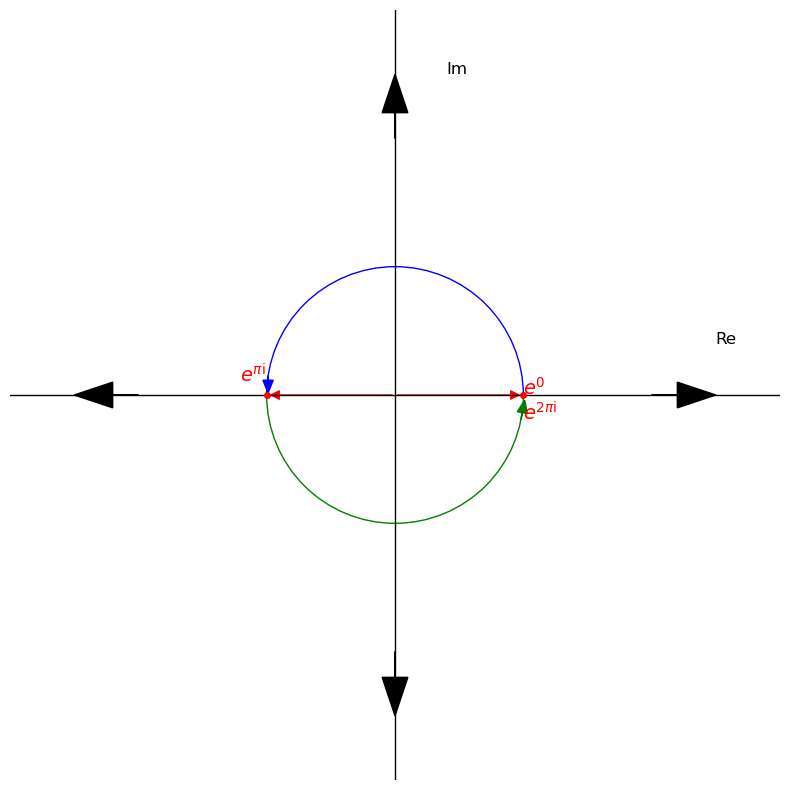
    


- The third power: $(e^{\pi\mathrm{i}})^3 = e^{3\pi\mathrm{i}}$


    
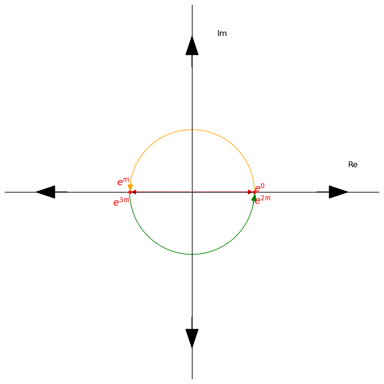
    


- The fourth power: $(e^{\pi\mathrm{i}})^4 = e^{4\pi\mathrm{i}}$


    
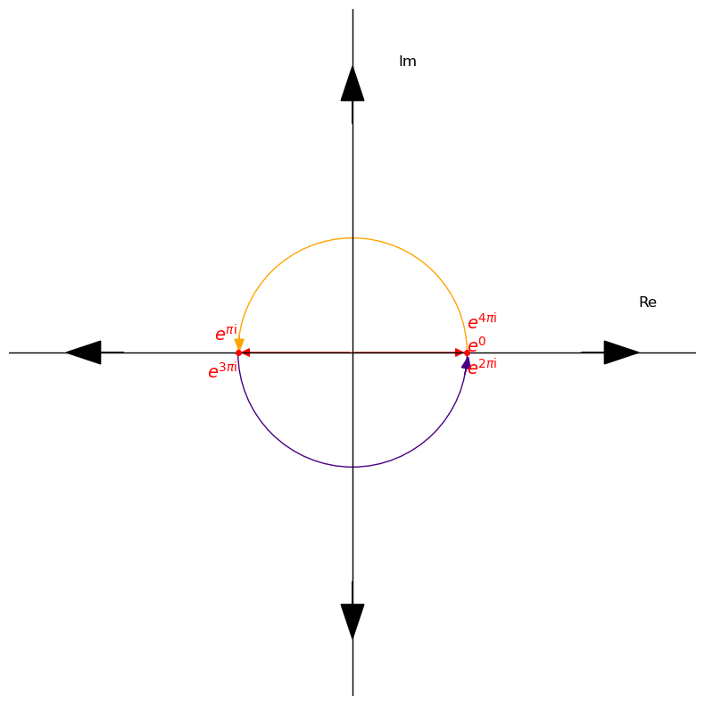
    


-----

For $e^{\pi\mathrm{i}/{2}}$:

- We compute the zero power: $(e^{\pi\mathrm{i}/{2}})^0 = e^0$


    

    


- The first power: $(e^{\pi\mathrm{i}/{2}})^1 = e^{\pi\mathrm{i}/{2}}$


    
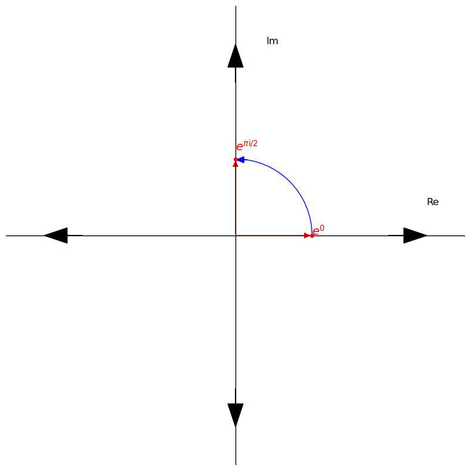
    


- The second power: $(e^{\pi\mathrm{i}/{2}})^2 = e^{\pi\mathrm{i}}$


    
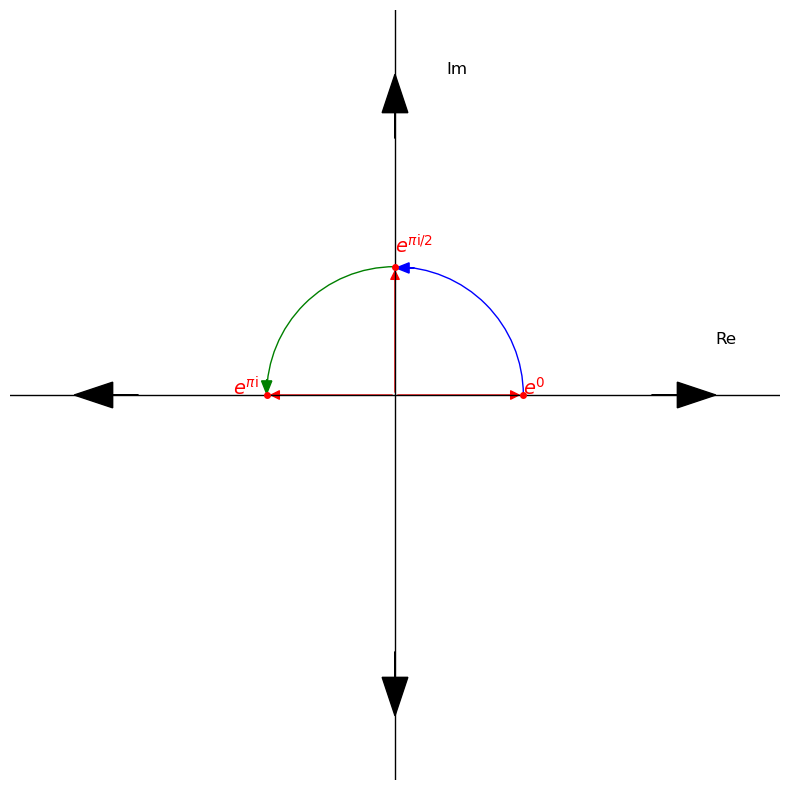
    


- The third power: $(e^{\pi\mathrm{i}/{2}})^3 = e^{3\pi\mathrm{i}/2}$


    
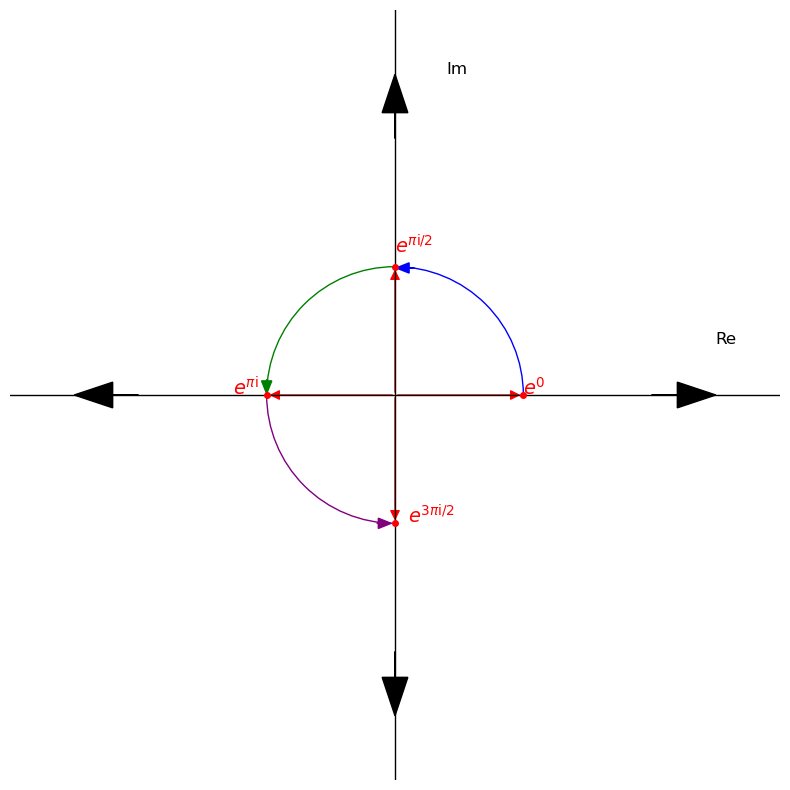
    


- The fourth power: $(e^{\pi\mathrm{i}/{2}})^4 = e^{2\pi\mathrm{i}}$


    
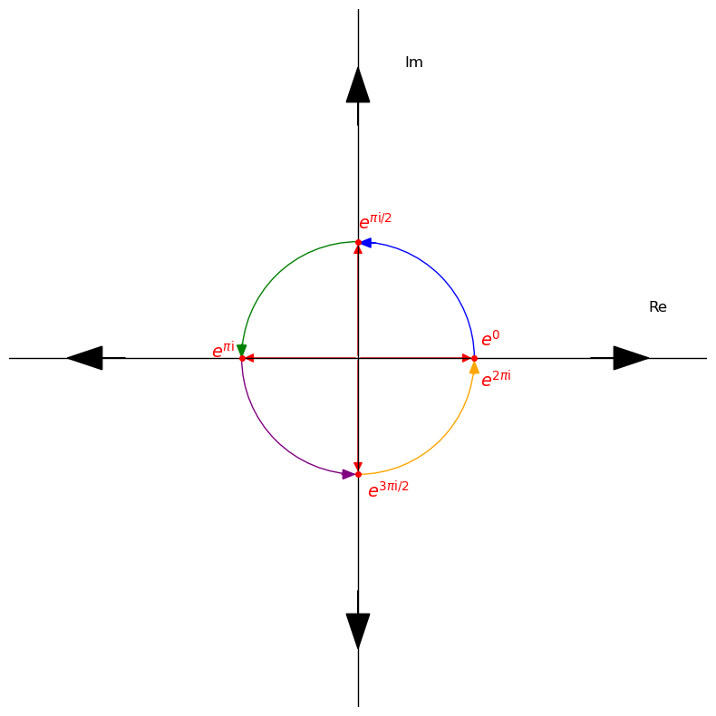
    


-----

For $e^{3\pi\mathrm{i}/{2}}$:

- We compute the zero power: $(e^{3\pi\mathrm{i}/{2}})^0 = e^0$


    

    


- The first power: $(e^{3\pi\mathrm{i}/{2}})^1 = e^{3\pi\mathrm{i}/{2}}$


    
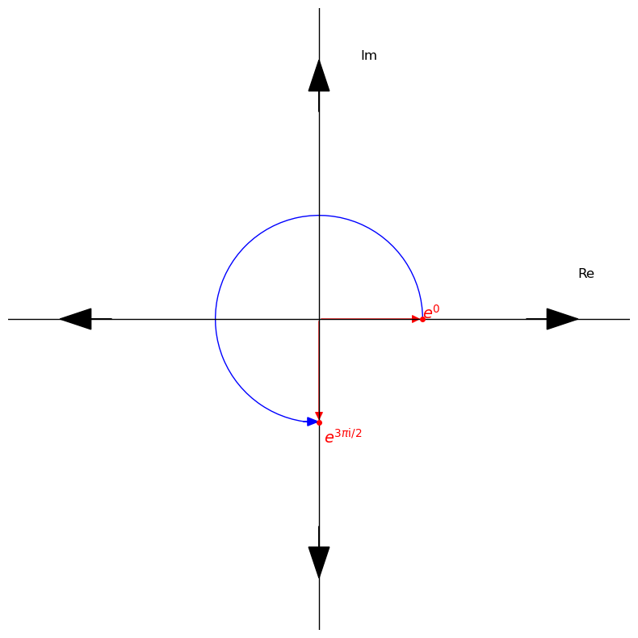
    


- The second power: $(e^{3\pi\mathrm{i}/{2}})^2 = e^{3\pi\mathrm{i}}$


    

    


- The third power: $(e^{3\pi\mathrm{i}/{2}})^3 = e^{9\pi\mathrm{i}/2}$


    
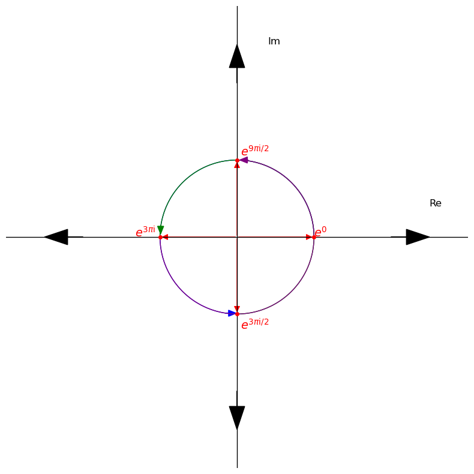
    


- The fourth power: $(e^{3\pi\mathrm{i}/{2}})^4 = e^{6\pi\mathrm{i}}$


    
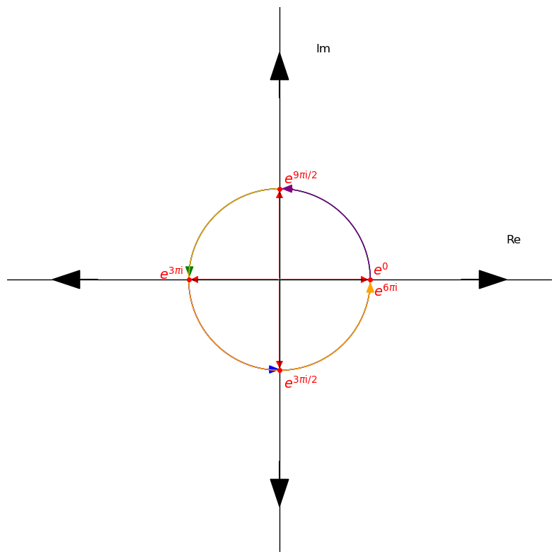
    


----

What do we notice?

- For $e^0$:
  - They are no rotations. It just remains at $1$
- For $e^{\pi\mathrm{i}}$:
  - It rotates between $1$ and $-1$ and it's at point $1$ at the powers divisible by $2$($2$ and $4$).
- For $e^{\pi\mathrm{i}/{2}}$:
  - It rotates across all roots and meets $1$ at the fourth power.
- For $e^{3\pi\mathrm{i}/{2}}$:
  - Same as $e^{\pi\mathrm{i}/{2}}$

Finally, what are roots of unity and why does all this matter?

The $n$th roots are unity are simply values of $x$ that satisfy the function $x^n = 1$ for an arbitrary $n$ value.

Having known this, notice how the roots $1$, $-1$, $\mathrm{i}$ and $-\mathrm{i}$ all satisfy function $x^4 = 1$. That is:

- $1^4 = 1$ and $(e^0)^4 = 1$
- $-1^4 = 1$ and $(e^{\pi\mathrm{i}})^4 = 1$
- $\mathrm{i}^4 = 1$ and $(e^{\pi\mathrm{i}/{2}})^4 = e^{2\pi\mathrm{i}} = 1$
- $(-\mathrm{i})^4 = 1$ and $(e^{3\pi\mathrm{i}/{2}})^4 = e^{6\pi\mathrm{i}} = 1$

And, how $x^4 - 1 = 0$ is equals $x^4 = 1$.

These are $4$th roots of unity.

But then, what about the polynomial $P(x) = 1 + x + x^2$, does that hold for it too? Let's find out.

Given the polynomial $x^3 - 1$, let's find the roots.

- $(x^3 - 1) = (x - 1)(1 + x + x^2) = (x - 1)P(x)$

Setting them to zero, we have that: 
- $x - 1 = 0$, $x = 1$
- $P(x) = 0$, we already know the roots are $\dfrac{-1}{2} + \dfrac{\sqrt{3}\mathrm{i}}{2}$ and $\dfrac{-1}{2} - \dfrac{\sqrt{3}\mathrm{i}}{2}$.

Therefore, $1$, $\dfrac{-1}{2} + \dfrac{\sqrt{3}\mathrm{i}}{2}$ and $\dfrac{-1}{2} - \dfrac{\sqrt{3}\mathrm{i}}{2}$ are the $3$rd roots of unity. That is:

- $1^3 = 1$ and $(e^0)^3 = 1$
- $(\dfrac{-1}{2} + \dfrac{\sqrt{3}\mathrm{i}}{2})^3 = 1$ and $(e^{2\pi\mathrm{i}/3})^3 = e^{2\pi\mathrm{i}} = 1$
- $(\dfrac{-1}{2} - \dfrac{\sqrt{3}\mathrm{i}}{2})^3 = 1$ and $(e^{4\pi\mathrm{i}/3})^3 = e^{4\pi\mathrm{i}} = 1$

Let's extract more insights from our argand diagrams.

Notice how in the $3$rd roots of unity, $e^{2\pi\mathrm{i}/3}$ and $e^{4\pi\mathrm{i}/3}$ generates every other root in the set and in the $4$th roots of unity $e^{\pi\mathrm{i}/{2}}$ and $e^{3\pi\mathrm{i}/{2}}$ also generates every other other roots in the set. For example,
- For $e^{2\pi\mathrm{i}/3}$ in the $3$rd roots of unity:
  - $(e^{2\pi\mathrm{i}/3})^ 0 = 1$
  - $(e^{2\pi\mathrm{i}/3})^ 1 = e^{2\pi\mathrm{i}/3}$
  - $(e^{2\pi\mathrm{i}/3})^ 2 = e^{4\pi\mathrm{i}/3}$
- For $e^{3\pi\mathrm{i}/{2}}$ in the $4$th roots of unity:
  - $(e^{3\pi\mathrm{i}/{2}})^ 0 = 1$
  - $(e^{3\pi\mathrm{i}/{2}})^ 1 = e^{3\pi\mathrm{i}/{2}}$
  - $(e^{3\pi\mathrm{i}/{2}})^ 2 = e^{3\pi\mathrm{i}} = e^{\pi\mathrm{i}}$
  - $(e^{3\pi\mathrm{i}/{2}})^ 3 = e^{9\pi\mathrm{i}/{2}} = e^{\pi\mathrm{i}/{2}}$

When a root generates all other roots in the set, it is called a **primitive root of unity**. This is evident in the diagrams as $e^{\pi\mathrm{i}/{2}}$ and $e^{3\pi\mathrm{i}/{2}}$ hits every root of unity as it rotates around the circle.

There's something that has been recurring ever since we started talking about roots of polynomials: the modulus $r$ has always been $1$. This is not a concidence.

If you interpret $r$ as the radius of a circle being the **unit circle**(i.e a circle of radius $1$) then every root of unity is a point on the unit circle hence the name *roots of unity*.

And, there's a general formular for representing every $n$th root of unity: $$e^{{2\pi\mathrm{i} \ast k}/n}$$ where $n$ is an arbitrary value and $k = 0, 1, \cdots, n - 1$.

For example:

- The $5$th roots of unity are $\lbrace e^{{2\pi\mathrm{i} \ast 0}/5}, e^{{2\pi\mathrm{i}\ast 1}/5}, e^{{2\pi\mathrm{i} \ast 2}/5}, e^{{2\pi\mathrm{i} \ast 3}/5}, e^{{2\pi\mathrm{i} \ast 4}/5} \rbrace = \lbrace e^0, e^{{2\pi\mathrm{i}}/5}, e^{{4\pi\mathrm{i}}/5}, e^{{6\pi\mathrm{i}}/5}, e^{{8\pi\mathrm{i}}/5} \rbrace$


    
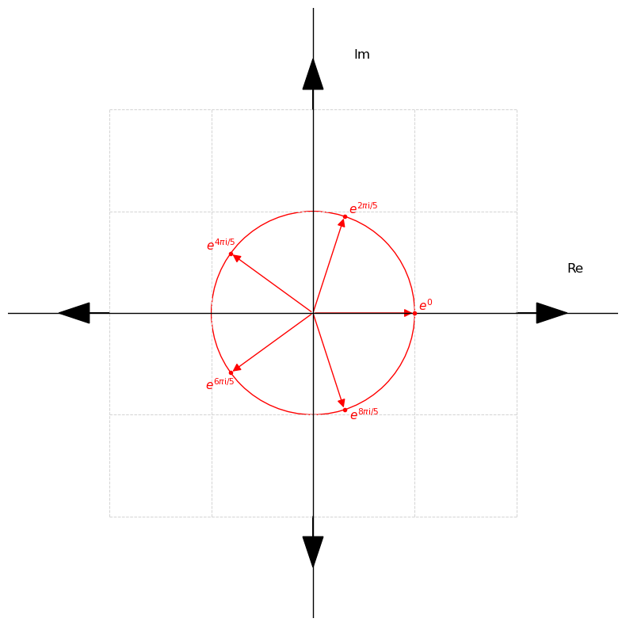
    


- The $8$th roots of unity are $\lbrace e^{{2\pi\mathrm{i} \ast 0}/8}, e^{{2\pi\mathrm{i} \ast 1}/8}, e^{{2\pi\mathrm{i} \ast 2}/8}, e^{{2\pi\mathrm{i} \ast 3}/8}, e^{{2\pi\mathrm{i} \ast 4}/8}, e^{{2\pi\mathrm{i} \ast 5}/8}, e^{{2\pi\mathrm{i} \ast 6}/8}, e^{{2\pi\mathrm{i} \ast 7}/8} \rbrace = \lbrace e^{0}, e^{{\pi\mathrm{i}}/4}, e^{{\pi\mathrm{i}}/2}, e^{{3\pi\mathrm{i}}/4}, e^{\pi\mathrm{i}}, e^{{5\pi\mathrm{i}}/4}, e^{{3\pi\mathrm{i}}/2}, e^{{7\pi\mathrm{i}}/4} \rbrace $


    
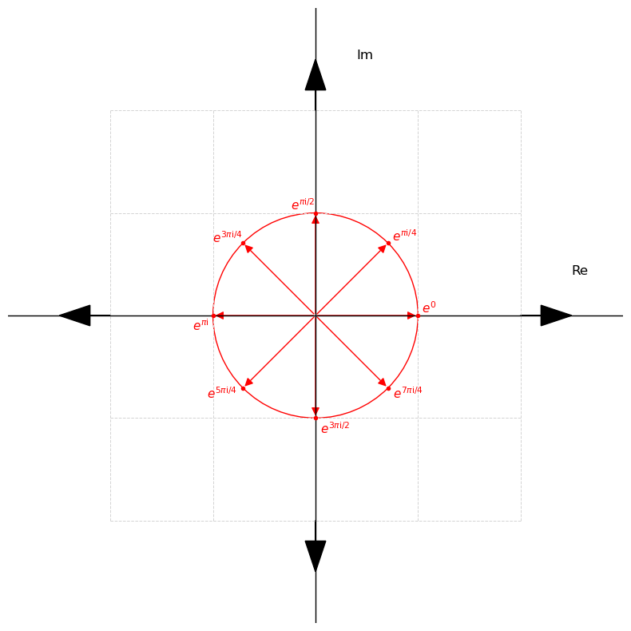
    


---

A common way of representing roots of unity is in terms of the primitive root of unity. Recall that a primitive root of unity generates all other roots of unity.

Given a primitive root of unity $\omega_n$, the roots of unity are $\lbrace \omega_n^{0}, \omega_n^{1}, ... , \omega_n^{n - 1} \rbrace$ where $n$ is an arbitrary positive number.

For example, from the $8$th roots of unity, we pick the primitive root $\omega_8 = e^{{\pi\mathrm{i}}/4}$. That $8$th roots of unity are as follows: $$\omega^k_8 = \lbrace \omega_8^0, \omega_8^1, \omega_8^2, \omega_8^3, \omega_8^4, \omega_8^5, \omega_8^6, \omega_8^7 \rbrace$$

---

Another important property of roots of unity is that every root has a *complex conjugate* and that complex conjugate is the point symmetric to it on the unit circle.

The complex conjugate of a complex number $a + b\mathrm{i}$ is $a - b\mathrm{i}$ and that of $a - b\mathrm{i}$ is $a + b\mathrm{i}$. But then, when these are on the unit circle, the complex conjugate of any root is simply it's vertical reflexion. 

For example, from the $8$th roots of unity above, Here are the complex conjugates:
- $e^{3\pi\mathrm{i}/4}$ is $e^{5\pi\mathrm{i}/4}$
- $e^{\pi\mathrm{i}/4}$ is $e^{7\pi\mathrm{i}/4}$
- $e^{\pi\mathrm{i}/2}$ is $e^{3\pi\mathrm{i}/2}$

Here are the $8$th roots of unity in rectangular form for clarification: $$\begin{aligned} \omega_8^k &= \lbrace e^{0}, e^{{\pi\mathrm{i}}/4}, e^{{\pi\mathrm{i}}/2}, e^{{3\pi\mathrm{i}}/4}, e^{\pi\mathrm{i}}, e^{{5\pi\mathrm{i}}/4}, e^{{3\pi\mathrm{i}}/2}, e^{{7\pi\mathrm{i}}/4} \rbrace \\\\[3pt] &= \lbrace 1, \dfrac{\sqrt{2}}{2} + \mathrm{i}\dfrac{\sqrt{2}}{2}, \mathrm{i}, -\dfrac{\sqrt{2}}{2} + \mathrm{i}\dfrac{\sqrt{2}}{2}, -1, -\dfrac{\sqrt{2}}{2} - \mathrm{i}\dfrac{\sqrt{2}}{2}, - \mathrm{i}, \dfrac{\sqrt{2}}{2} - \mathrm{i}\dfrac{\sqrt{2}}{2} \rbrace \end{aligned}$$

Interestingly, the complex conjugate of any root $e^{a\mathrm{i}}$ is $e^{-a\mathrm{i}}$. That is:

- $e^{5\pi\mathrm{i}/4} = e^{-5\pi\mathrm{i}/4} = e^{3\pi\mathrm{i}/4}$
- $e^{7\pi\mathrm{i}/4} = e^{-7\pi\mathrm{i}/4} = e^{\pi\mathrm{i}/4}$
- $e^{3\pi\mathrm{i}/2} = e^{-3\pi\mathrm{i}/2} = e^{\pi\mathrm{i}/2}$

A good mental model for complex conjugates is anticlockwise vs clockwise rotations. For example $e^{3\pi\mathrm{i}/4}$ is the angle $3\pi/4$ in the anticlockwise direction while $e^{5\pi\mathrm{i}/4}$ is the same angle in clockwise direction.

An even better way to interprete this is *performing a rotation and undoing that rotation*.

For example, in the diagram below, we have a value $2$.


    

    


Let's multiply 2 by $e^{{3\pi\mathrm{i}}/4}$. We have $2e^{{3\pi\mathrm{i}}/4}$.


    
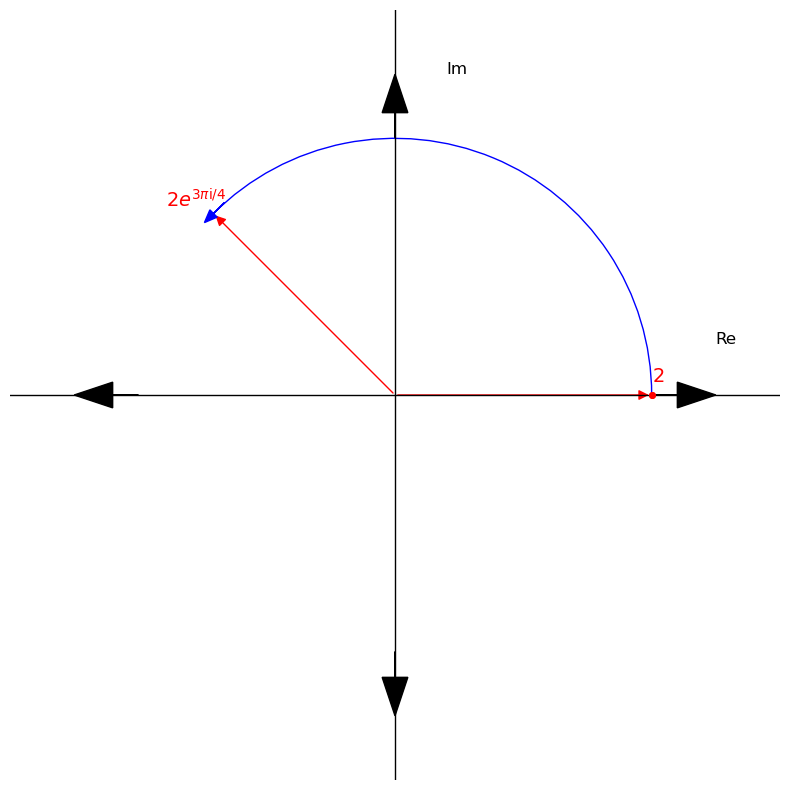
    


Now, let's multiply $2e^{{3\pi\mathrm{i}}/4}$ by the complex conjugate of $e^{{3\pi\mathrm{i}}/4}$, $e^{5\pi\mathrm{i}/4}$. That is $2e^{{3\pi\mathrm{i}}/4} * e^{5\pi\mathrm{i}/4} = 2e^{{2\pi\mathrm{i}}}$.


    
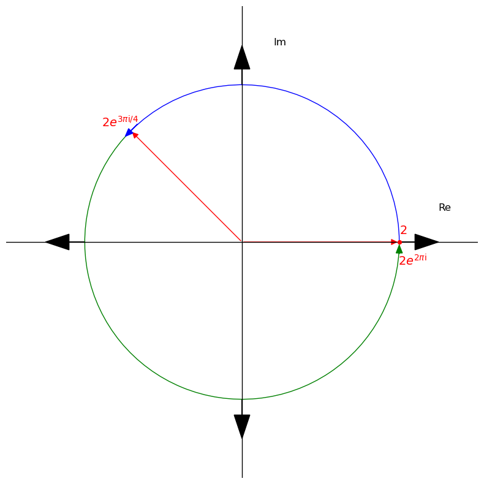
    


As you can see in the diagrams $e^{{3\pi\mathrm{i}}/4}$ rotated $2$ by ${3\pi}/4$ and $e^{{5\pi\mathrm{i}}/4}$ undid that rotation taking $2e^{{3\pi\mathrm{i}}/4}$ back to $2$.

This is a key concept in next our topic: **Discrete Fourier Transform** as we get closer to understanding FFT.

## Discrete Fourier Transform (DFT)

Let's go back to where it all started: *Polynomial multiplication*.

Recall, we chose a set of $x$ values, $x_i = \lbrace x_0, x_1,..., x_n \rbrace$ and evaluated $f(x_i)$ to get the set of points $(x_0, f(x_0)), (x_1, f(x_1)),...,(x_d, f(x_d))$ and we called it the **point representation**.

Now, let's use roots of unit as those set $x$ values; our evaluation points. Given a primitive root of unity $\omega_n$, we have our roots of unit $w_n^k = \lbrace \omega_n^0, \omega_n^1, \omega_n^2, ..., \omega_n^{n - 1} \rbrace$.

With this, we have the following:

$$\begin{aligned} V &= \begin{bmatrix} \omega_n^{0*0} & \omega_n^{0*1} & {\omega_n}^{0*2} & \cdots & \omega_n^{0*(n - 1)} \\\\ \omega_n^{1*0} & \omega_n^{1*1} & \omega_n^{1*2} & \cdots & \omega_n^{1*(n - 1)} \\\\ \omega_n^{2*0} & \omega_n^{2*1} & \omega_n^{2*2} & \cdots & \omega_n^{2*(n - 1)} \\\\[0.3em] \vdots & \vdots & \vdots & \ddots & \vdots \\\\[0.3em] \omega_n^{(n - 1)*0} & \omega_n^{(n - 1)*1} & \omega_n^{(n - 1)*2} & \cdots & \omega_n^{(n - 1)(n - 1)} \end{bmatrix} \\\\[2pt] &= \begin{bmatrix}\omega_n^0 & \omega_n^0 & \omega_n^0 & \cdots & \omega_n^0 \\\\ \omega_n^0 & \omega_n^1 & \omega_n^2 & \cdots & \omega_n^{n - 1} \\\\ \omega_n^0 & \omega_n^2 & \omega_n^4 & \cdots & \omega_n^{2n - 2} \\\\[0.3em]\vdots & \vdots & \vdots & \ddots & \vdots \\\\[0.3em] \omega_n^0 & \omega_n^{n - 1} & \omega_n^{2n - 2} & \cdots & \omega_n^{n^2 - 2n + 1} \end{bmatrix} \end{aligned}$$

$$a = \begin{bmatrix}a_0 \\\\ a_1 \\\\ a_2 \\\\ \vdots \\\\ a_{n - 1}\end{bmatrix}$$

$$\begin{aligned}  Va &= \begin{bmatrix}a_0\omega_n^0 + a_1\omega_n^0 + a_2\omega_n^0 + \cdots + a_{n - 1}w_n^0 \\\\ a_0\omega_n^0 + a_1\omega_n^1 + a_2\omega_n^2 + \cdots + a_{n - 1}\omega_n^{n - 1} \\\\ a_0\omega_n^0 + a_1\omega_n^2 + a_2\omega_n^4 + \cdots + a_{n - 1}\omega_n^{2n - 2} \\\\ \vdots \\\\ a_0\omega_n^0 + a_1\omega_n^{n - 1} + a_2\omega_n^{2n - 2} + \cdots + a_{n - 1}\omega_n^{n^2 - 2n + 1} \end{bmatrix} \\\\[2pt] &= \begin{bmatrix} f(\omega_n^0) \\\\ f(\omega_n^1) \\\\ f(\omega_n^2) \\\\ \vdots \\\\ f(\omega_n^{n - 1}) \end{bmatrix} \\\\[2pt] &= f(w_n^k) \end{aligned}$$

Breifly, what is DFT? DFT is an algorithm that turns a signal from the time domain into the frequency domain. It used in Signal analysis, Image Compression and a lot more. 

A good way to look at DFT is an algorithm that seeks to get more information from individual values that were created out of a combination of different measurements of values. For instance, given an chord(a chord is a set of notes played together), DFT can be used to get the frequency of the individual notes that makes up the chord.


Why do we care about DFT? The DFT algorithm is equalivent to polynomial evaluation using roots of unity as we shown above. It runs in $O(n^2)$ time and **FFT is an optimization of DFT and it run in $O(n\log(n))$ time**.

We are going to see how DFT is used and after that we are going to see how FFT is derived from the construction of DFT. 

Let's see an example. Using the $4$th roots of unity, let's compute $C(x) = A(x) * B(x)$ where $A(x) = 1 + 2x$, $B(x) = 3 + 4x$ and $C(x) = 3 + 10x + 8x^2$.

- **Step 1**: Pick a primitive root of unity and define the the vandermonde matrix $V$ 

  $$\omega_4 = e^{{3\pi\mathrm{i}}/2}$$

  $$\begin{aligned} \omega_4 &= \lbrace \omega_4^{0}, \omega_4^{1}, \omega_4^{2}, \omega_4^{3} \rbrace \\\\[2pt] &= \lbrace 1, e^{{3\pi\mathrm{i}}/2}, e^{3\pi\mathrm{i}}, e^{{9\pi\mathrm{i}}/2} \rbrace \end{aligned} $$  

$$ \begin{aligned} V &= 
     \begin{bmatrix}
     \omega_4^{0*0} & \omega_4^{0*1} & {\omega_4}^{0*2} & \omega_4^{0*3}
     \\\\ \omega_4^{1*0} & \omega_4^{1*1} & {\omega_4}^{1*2} & \omega_4^{1*3} 
     \\\\ \omega_4^{2*0} & \omega_4^{2*1} & {\omega_4}^{2*2} & \omega_4^{2*3} 
     \\\\  \omega_4^{3*0} & \omega_4^{3*1} & {\omega_4}^{3*2} & \omega_4^{3*3}
     \end{bmatrix} \\\\[2pt] &= 
     \begin{bmatrix} \omega_4^{0} & \omega_4^{0} & {\omega_4}^{0} & \omega_4^{0}
     \\\\ \omega_4^{0} & \omega_4^{1} & {\omega_4}^{2} & \omega_4^{3}
     \\\\ \omega_4^{0} & \omega_4^{2} & {\omega_4}^{4} & \omega_4^{6}
     \\\\  \omega_4^{0} & \omega_4^{3} & {\omega_4}^{6} & \omega_4^{9}
     \end{bmatrix} \\\\[2pt] &= 
     \begin{bmatrix} 1 & 1 & 1 & 1 
     \\\\ 1 & e^{{3\pi\mathrm{i}}/2} & e^{3\pi\mathrm{i}} & e^{{9\pi\mathrm{i}}/2}
     \\\\ 1 & e^{3\pi\mathrm{i}} & e^{6\pi\mathrm{i}} & e^{9\pi\mathrm{i}}
     \\\\ 1 & e^{{9\pi\mathrm{i}}/2} & e^{9\pi\mathrm{i}} & e^{{27\pi\mathrm{i}}/2}
     \end{bmatrix} \end{aligned}$$

- **Step 2**: Compute the DFT of $A(x)$ and $B(x)$, $\mathrm{DFT}(A)$ and $\mathrm{DFT}(B)$ respectively.

  The formula for computing the DFT is $X[k] = \sum_{n=0}^{N-1} x[n]\, \omega_N^{kn}$ where $\omega_N = e^{-2\pi i / N}$ and $N$ is the $N$th root of unity.

  This is the same as $f(x_i) = \sum^{n}_{j=0}a_jx^j_i$ from earlier but updated to show that we are using the roots of unity as our evaluations points.

  $DFT(A)$:

  $$a = \begin{bmatrix}1 \\\\ 2 \\\\ 0 \\\\ 0 \end{bmatrix}$$

  $$\begin{aligned} Va &= \begin{bmatrix}
     (1 \cdot 1) + (1 \cdot 2)
     \\\\ (1 \cdot 1) + (e^{{3\pi\mathrm{i}}/2} \cdot 2)
     \\\\ (1 \cdot 1) + (e^{3\pi\mathrm{i}} \cdot 2)  
     \\\\ (1 \cdot 1) + (e^{{9\pi\mathrm{i}}/2} \cdot 2) 
     \end{bmatrix} \\\\[2pt] &= 
     \begin{bmatrix} 3 
     \\\\ 1 + 2e^{{3\pi\mathrm{i}}/2} 
     \\\\ 1 + 2e^{3\pi\mathrm{i}} 
     \\\\ 1 + 2e^{{9\pi\mathrm{i}}/2}
     \end{bmatrix} \end{aligned} $$

  $DFT(B)$:

  $$a = \begin{bmatrix}3 \\\\ 4 \\\\ 0 \\\\ 0 \end{bmatrix}$$

  $$\begin{aligned} Va &= \begin{bmatrix}
     (1 \cdot 3) + (1 \cdot 4)
     \\\\ (1 \cdot 3) + (e^{{3\pi\mathrm{i}}/2} \cdot 4) 
     \\\\ (1 \cdot 3) + (e^{3\pi\mathrm{i}} \cdot 4) 
     \\\\ (1 \cdot 3) + (e^{{9\pi\mathrm{i}}/2} \cdot 4) 
     \end{bmatrix} \\\\[2pt] &= 
     \begin{bmatrix} 7 
     \\\\ 3 + 4e^{{3\pi\mathrm{i}}/2}
     \\\\ 3 + 4e^{3\pi\mathrm{i}} 
     \\\\ 3 + 4e^{{9\pi\mathrm{i}}/2} 
     \end{bmatrix} \end{aligned} $$

- Step 3: Compute the pairwise multiplication $DFT(A) \cdot DFT(B)$

$$\begin{aligned} DFT(A) \cdot DFT(B) &= 
     \begin{bmatrix} 3 
     \\\\ 1 + 2e^{{3\pi\mathrm{i}}/2} 
     \\\\ 1 + 2e^{3\pi\mathrm{i}} 
     \\\\ 1 + 2e^{{9\pi\mathrm{i}}/2}
     \end{bmatrix}
     \cdot
     \begin{bmatrix} 7 
     \\\\ 3 + 4e^{{3\pi\mathrm{i}}/2}
     \\\\ 3 + 4e^{3\pi\mathrm{i}} 
     \\\\ 3 + 4e^{{9\pi\mathrm{i}}/2} 
     \end{bmatrix}
     \\\\[2pt] &= 
     \begin{bmatrix}
     21
     \\\\ 3 + 10e^{{3\pi\mathrm{i}}/2} + 8e^{3\pi\mathrm{i}}
     \\\\ 3 + 10e^{3\pi\mathrm{i}} + 8e^{6\pi\mathrm{i}}
     \\\\ 3 + 10e^{{9\pi\mathrm{i}}/2} + 8e^{9\pi\mathrm{i}}
     \end{bmatrix}
     \end{aligned}
$$

- Step 4: Compute the inverse DFT of $DFT(A) \cdot DFT(B)$.

  This takes us back to coefficient form. The formula for this is $$IDFT(DFT(A)\cdot DFT(B)) = x[n] = \frac{1}{N} \sum_{k=0}^{N-1} X[k]\, \omega_N^{-kn}$$ This simply means we perform the same operation as before but now we pick the positive primitive root of unity and pick $a = DFT(A).DFT(B)$, then we divide the resulting $Va$ by N being $4$ in this case.

  This formula is different from the one we used this process earlier because of the percularities of complex numbers and roots of unity but it's requires less operations. For instance, we don't need to find the inverse of the matrix $V$.

    $$\omega_4 = e^{{\pi\mathrm{i}}/2}$$

  $$ \begin{aligned} \omega_4 &= \lbrace \omega_4^{0}, \omega_4^{1}, \omega_4^{2}, \omega_4^{3} \rbrace \\\\[2pt] &= \lbrace 1, e^{{\pi\mathrm{i}}/2}, e^{\pi\mathrm{i}}, e^{{3\pi\mathrm{i}}/2} \rbrace \end{aligned}$$  

$$\begin{aligned} V &= 
     \begin{bmatrix} \omega_4^{0} & \omega_4^{0} & {\omega_4}^{0} & \omega_4^{0}
     \\\\ \omega_4^{0} & \omega_4^{1} & {\omega_4}^{2} & \omega_4^{3}
     \\\\ \omega_4^{0} & \omega_4^{2} & {\omega_4}^{4} & \omega_4^{6}
     \\\\  \omega_4^{0} & \omega_4^{3} & {\omega_4}^{6} & \omega_4^{9}
     \end{bmatrix} \\\\[2pt] &= 
     \begin{bmatrix} 1 & 1 & 1 & 1 
     \\\\ 1 & e^{{\pi\mathrm{i}}/2} & e^{\pi\mathrm{i}} & e^{{3\pi\mathrm{i}}/2}
     \\\\ 1 & e^{\pi\mathrm{i}} & e^{2\pi\mathrm{i}} & e^{3\pi\mathrm{i}}
     \\\\ 1 & e^{{3\pi\mathrm{i}}/2} & e^{3\pi\mathrm{i}} & e^{{9\pi\mathrm{i}}/2}
     \end{bmatrix} \end{aligned}$$

$$a = \begin{bmatrix}
     21
     \\\\ 3 + 10e^{{3\pi\mathrm{i}}/2} + 8e^{3\pi\mathrm{i}}
     \\\\ 3 + 10e^{3\pi\mathrm{i}} + 8e^{6\pi\mathrm{i}}
     \\\\ 3 + 10e^{{9\pi\mathrm{i}}/2} + 8e^{9\pi\mathrm{i}}
     \end{bmatrix}$$

$$\begin{aligned} Va &= \begin{bmatrix} 1 & 1 & 1 & 1 
     \\\\ 1 & e^{{\pi\mathrm{i}}/2} & e^{\pi\mathrm{i}} & e^{{3\pi\mathrm{i}}/2}
     \\\\ 1 & e^{\pi\mathrm{i}} & e^{2\pi\mathrm{i}} & e^{3\pi\mathrm{i}}
     \\\\ 1 & e^{{3\pi\mathrm{i}}/2} & e^{3\pi\mathrm{i}} & e^{{9\pi\mathrm{i}}/2}
     \end{bmatrix}
     \cdot
      \begin{bmatrix}
     21
     \\\\ 3 + 10e^{{3\pi\mathrm{i}}/2} + 8e^{3\pi\mathrm{i}}
     \\\\ 3 + 10e^{3\pi\mathrm{i}} + 8e^{6\pi\mathrm{i}}
     \\\\ 3 + 10e^{{9\pi\mathrm{i}}/2} + 8e^{9\pi\mathrm{i}}
     \end{bmatrix}
     \\\\[2pt] &=
    \begin{bmatrix}
     21 + (3 + 10e^{{3\pi\mathrm{i}}/2} + 8e^{3\pi\mathrm{i}}) + (3 + 10e^{3\pi\mathrm{i}} + 8e^{6\pi\mathrm{i}}) + (3 + 10e^{{9\pi\mathrm{i}}/2} + 8e^{9\pi\mathrm{i}})
     \\\\  21 + (e^{{\pi\mathrm{i}}/2} \cdot (3 + 10e^{{3\pi\mathrm{i}}/2} + 8e^{3\pi\mathrm{i}})) + (e^{\pi\mathrm{i}} \cdot (3 + 10e^{3\pi\mathrm{i}} + 8e^{6\pi\mathrm{i}})) + (e^{{3\pi\mathrm{i}}/2} \cdot (3 + 10e^{{9\pi\mathrm{i}}/2} + 8e^{9\pi\mathrm{i}}))
     \\\\  21 + (e^{\pi\mathrm{i}}  \cdot (3 + 10e^{{3\pi\mathrm{i}}/2} + 8e^{3\pi\mathrm{i}})) + (e^{2\pi\mathrm{i}} \cdot (3 + 10e^{3\pi\mathrm{i}} + 8e^{6\pi\mathrm{i}})) + (e^{3\pi\mathrm{i}} \cdot (3 + 10e^{{9\pi\mathrm{i}}/2} + 8e^{9\pi\mathrm{i}}))
     \\\\  21 + (e^{{3\pi\mathrm{i}}/2} \cdot (3 + 10e^{{3\pi\mathrm{i}}/2} + 8e^{3\pi\mathrm{i}})) + (e^{3\pi\mathrm{i}} \cdot (3 + 10e^{3\pi\mathrm{i}} + 8e^{6\pi\mathrm{i}})) + (e^{{9\pi\mathrm{i}}/2} \cdot (3 + 10e^{{9\pi\mathrm{i}}/2} + 8e^{9\pi\mathrm{i}}))
     \end{bmatrix}
     \\\\[2pt] &=
    \begin{bmatrix}
     12
     \\\\ 40
     \\\\ 32
     \\\\ 0
     \end{bmatrix}
     \end{aligned}
     $$

$$\begin{aligned}IDFT(DFT(A)\cdot DFT(B)) &= \dfrac{1}{N}Va \\\\[2pt] &= \dfrac{1}{4}Va \\\\[2pt] &= \dfrac{1}{4} \cdot \begin{bmatrix}
     12
     \\\\ 40
     \\\\ 32
     \\\\ 0
     \end{bmatrix}
     \\\\[2pt] &=
     \begin{bmatrix}
     3
     \\\\ 10
     \\\\ 8
     \\\\ 0
     \end{bmatrix} \end{aligned}$$

To better understand $Va$, recall that $e^{{3\pi\mathrm{i}}/2}$ is $-\mathrm{i}$, $e^{3\pi\mathrm{i}}$ is $-1$ and $e^{{9\pi\mathrm{i}}/2}$ is $\mathrm{i}$

As you can see, we have successfully performed polynomial multiplication using DFT! Finally, let's see how FFT works!

## How FFT works

FFT is a recursive exploits the structure of the DFT construction and two properties of roots of unity.

So far, we have explored DFT using matrices and matrix multiplication. But, to better understand FFT you need to view DFT in terms of the formulas $X[k] = \sum_{n=0}^{N-1} x[n]\, \omega_N^{kn}$ and $x[n] = \frac{1}{N} \sum_{k=0}^{N-1} X[k]\, \omega_N^{-kn}$ so let's do that.

Using same $A(x)$ and $B(x)$ from above, let's compute $DFT$ and $IDFT$ using the formulas

For DFT: $X[k] = \sum_{n=0}^{N-1} x[n]\, \omega_N^{kn}$

- $A(x)$:
  
  - $X[0] = x[0] + x[1] + x[2] + x[3] = 1 + 2 + 0 + 0 = 3$
  - $X[1] = x[0] + x[1]\omega_4 + x[2]\omega_4^{2} + x[3]\omega_4^{3} = 1 + 2\omega_4$
  - $X[2] = x[0] + x[1]\omega_4^{2} + x[2]\omega_4^{4} + x[3]\omega_4^{6} = 1 + 2\omega_4^2$
  - $X[3] = x[0] + x[1]\omega_4^{3} + x[2]\omega_4^{6} + x[3]\omega_4^{9} = 1 + 2\omega_4^3$

    
- $B(x)$:
  
  - $X[0] = x[0] + x[1] + x[2] + x[3] = 3 + 4 + 0 + 0 = 7$
  - $X[1] = x[0] + x[1]\omega_4 + x[2]\omega_4^{2} + x[3]\omega_4^{3} = 3 + 4\omega_4$
  - $X[2] = x[0] + x[1]\omega_4^{2} + x[2]\omega_4^{4} + x[3]\omega_4^{6} = 3 + 4\omega_4^2$
  - $X[3] = x[0] + x[1]\omega_4^{3} + x[2]\omega_4^{6} + x[3]\omega_4^{9} = 3 + 4\omega_4^3$


For IDFT: $x[n] = \frac{1}{N} \sum_{k=0}^{N-1} X[k]\, \omega_N^{-kn}$ 
  - $x[0] = \dfrac{1}{4}(X[0] + X[1] + X[2] + X[3]) = 3$
  - $x[1] = \dfrac{1}{4}(X[0] + X[1]\omega_4^{-1} + X[2]\omega_4^{-2} + X[3]\omega_4^{-3}) = 10$
  - $x[2] = \dfrac{1}{4}(X[0] + X[1]\omega_4^{-2} + X[2]\omega_4^{-4} + X[3]\omega_4^{-6}) = 8$
  - $x[3] = \dfrac{1}{4}(X[0] + X[1]\omega_4^{-3} + X[2]\omega_4^{-6} + X[3]\omega_4^{-9}) = 0$

Secondly, here are the two properties of roots of unity that ultimately makes FFT possible.

1. $-\omega_N^k = \omega_N^{k + N/2}$. This is gotten from the fact that $\omega_N^{N/2} = -1$
2. $\omega_N^2 = \omega_{N/2}$. For example, $e^{{\pi\mathrm{i}}/4}$ is a primitive root from the $8$th of unity and $(e^{{\pi\mathrm{i}}/4})^2$ is $e^{{\pi\mathrm{i}}/2}$ being a primitive root from the $4$th roots of unity.

As you probably guessed, these only holds when $N$ is even.

Haven set the foundation, let's look at the FFT algorithm step by step.

Starting from the DFT formula: $X[k] = \sum_{n=0}^{N-1} x[n]\, \omega_N^{kn}$

- **Step 1**: We are going to split the formula into even/odd indices. Setting $n = 2m$ and $n = 2m + 1$ so that: $$\begin{aligned} X[k] &= \sum_{m=0}^{(N/2)-1} x[2m]\, \omega_N^{k(2m)} + \sum_{m=0}^{(N/2)-1} x[2m + 1]\, \omega_N^{k(2m + 1)} \\\\ &= \sum_{m=0}^{(N/2)-1} x[2m]\, \omega_{N/2}^{km} + \omega_N^{k} \sum_{m=0}^{(N/2)-1} x[2m + 1]\, \omega_{N/2}^{km} \end{aligned}$$

  Notice the second property at play here.
- **Step 2**: Let's label the parts:$$E[k] = \sum_{m=0}^{(N/2)-1} x[2m]\, \omega_{N/2}^{km}$$$$O[k] = \sum_{m=0}^{(N/2)-1} x[2m + 1]\, \omega_{N/2}^{km}$$ So that: $$X[k] = E[k] + \omega_N^{k}O[k]$$
- **Step 3**: Let's compute: $$X[k] = E[k] + \omega_N^{k}O[k]$$ $$X[k + N/2] = E[k] + \omega_N^{k + N/2}O[k]$$From the first property, we can update the as follows:$$X[k] = E[k] + \omega_N^{k}O[k]$$ $$X[k + N/2] = E[k] - \omega_N^{k}O[k]$$So, we just have to compute $E[k]$, $O[k]$ and $\omega_N^k$ and use it for both computations, flipping the sign on the second one.
- **Step 4**: We perform same steps recursively for $E[k]$ and $O[k]$ until $N = 1$.

Let's go through an example using $P(x) = 1 + 2x + 3x^2 + 4x^3$ using the $4$th roots of unity.

$x_i = \lbrace 1, 2, 3, 4 \rbrace$ 

We compute: $$X[0] = E[0] + \omega_4^{0}O[0]$$ $$X[2] = E[0] - \omega_4^0O[0]$$ and $$X[1] = E[1] + \omega_4O[1]$$ $$X[3] = E[1] - \omega_4O[1]$$

To solve we just have to compute $E[0]$, $O[0]$, $E[1]$ and $O[1]$.

$$\begin{aligned} E[0] &= \sum_{m=0}^{1} x[2m] \omega_{2}^{0} \\\\[2pt] &= \sum_{m=0}^{1} x[2m] \\\\[6pt] &= x[0] + x[2] \\\\[2pt] &= 1 + 3 \\\\[2pt] &= 4 \end{aligned}$$

$$\begin{aligned} O[0] &= \sum_{m=0}^{1} x[2m] \\\\[2pt] &= x[1] + x[3] \\\\[2pt] &= 2 + 4 \\\\[2pt] &= 6 \end{aligned}$$

$$\begin{aligned} E[1] &= \sum_{m=0}^{1} x[2m]\omega_{2}^k \\\\[2pt] &= x[0] + x[2]\omega_{2} \\\\[2pt] &= 1 + (3\cdot-1) \\\\[2pt] &= -2 \end{aligned}$$

$$\begin{aligned} O[1] &= \sum_{m=0}^{1} x[2m]  \omega_{2} \\\\[2pt] &= x[1] + x[3]\omega_{2} \\\\[2pt] &= 2 - 4 \\\\[2pt] &= -2 \end{aligned}$$

Now, let's use it in $X[k]$:

$$\begin{aligned} X[0] &= E[0] + \omega_4^{0}O[0] \\\\[2pt] &= E[0] + O[0] \\\\[2pt] &= 4 + 6 \\\\[2pt] &= 10 \end{aligned}$$

$$\begin{aligned} X[2] &= E[0] - O[0] \\\\[2pt] &= 4 - 6 \\\\[2pt] &= -2 \end{aligned}$$

$$\begin{aligned} X[1] &= E[1] + \omega_4O[1] \\\\[2pt] &= E[1] + \omega_4O[1] \\\\[2pt] &= -2 + (\omega_4 \cdot -2) \\\\[2pt] &= -2 + (e^{{3\pi\mathrm{i}}/2} \cdot -2) \\\\[2pt] &= -2 - 2e^{{3\pi\mathrm{i}}/2} \end{aligned}$$

$$\begin{aligned} X[3] &= E[1] - \omega_4O[1] \\\\[2pt] &= -2 + 2e^{{3\pi\mathrm{i}}/2} \end{aligned}$$

In the same vein, let's look into inverse FFT.

Starting from the inverse DFT formula: $x[n] = \frac{1}{N} \sum_{m=0}^{N-1} X[m]\, \omega_N^{-mn}$

$$\begin{aligned}x[n] &= \dfrac{1}{N}(\sum_{m=0}^{(N/2)-1} X[2m]\, \omega_N^{-n(2m)} + \sum_{m=0}^{(N/2)-1} X[2m + 1]\, \omega_N^{-n(2m + 1)}) \\\\[2pt] &= \dfrac{1}{N}(\sum_{m=0}^{(N/2)-1} X[2m]\, \omega_{N/2}^{-nm} + \omega_{N}^{-n}\sum_{m=0}^{(N/2)-1} X[2m + 1]\, \omega_{N/2}^{-nm}) \end{aligned}$$

The even and odd parts:

$$E[n] = \sum_{m=0}^{(N/2)-1} x[2m]\, \omega_{N/2}^{-nm}$$

$$O[n] = \sum_{m=0}^{(N/2)-1} x[2m + 1]\, \omega_{N/2}^{-nm}$$

Then:

$$x[n] = \dfrac{1}{N}(E[n] + \omega_N^{-n}O[n])$$ 

$$x[n + N/2] = \dfrac{1}{N}(E[n] - \omega_N^{-n}O[n])$$

Let's continue from the last example. We got the DFT as $\lbrace 10, -2 - 2e^{{3\pi\mathrm{i}}/2}, -2, -2 + 2e^{{3\pi\mathrm{i}}/2} \rbrace$. Let's compute the inverse DFT using inverse FFT.

$$x[0] = \dfrac{1}{4}(E[0] + \omega_4^{-0}O[0])$$

$$x[2] = \dfrac{1}{4}(E[0] - \omega_4^{-0}O[0])$$ and 

$$x[1] = \dfrac{1}{4}(E[1] + \omega_4^{-1}O[1])$$

$$x[3] = \dfrac{1}{4}(E[1] - \omega_4^{-1}O[1])$$

We will compute $E[0]$, $O[0]$, $E[1]$ and $O[1]$.

$$\begin{aligned} E[0] &= \sum_{m=0}^{1} X[2m] \\\\[2pt] &= X[0] + X[2] \\\\[2pt] &= 10 - 2 \\\\[2pt] &= 8 \end{aligned}$$

$$\begin{aligned} O[0] &= \sum_{m=0}^{1} X[2m] \\\\[2pt] &= X[1] + X[3] \\\\[2pt] &= -2 - 2e^{{3\pi\mathrm{i}}/2} -2 + 2e^{{3\pi\mathrm{i}}/2} \\\\[2pt] &= -4 \end{aligned}$$

$$\begin{aligned} E[1] &= \sum_{m=0}^{1} X[2m] \omega_{2}^{-m} \\\\[2pt] &= X[0] + X[2]\omega_{2}^{-1} \\\\[2pt] &= 10 + (-2\cdot-1) \\\\[2pt] &= 12 \end{aligned}$$

$$\begin{aligned} O[1] &= \sum_{m=0}^{1} X[2m]  \omega_{2}^{-m} \\\\[2pt] &= X[1] + X[3]\omega_{2}^{-1} \\\\[2pt] &= -2 - 2e^{{3\pi\mathrm{i}}/2} + (-2 + 2e^{{3\pi\mathrm{i}}/2}\cdot -1) \\\\[2pt] &= -2 - 2e^{{3\pi\mathrm{i}}/2} + 2 - 2e^{{3\pi\mathrm{i}}/2} \\\\[2pt] &= -4e^{{3\pi\mathrm{i}}/2}  \end{aligned}$$

Now, let's use it in $x[n]$:

$$\begin{aligned} x[0] &= \dfrac{1}{4}(E[0] + \omega_4^{0}O[0]) \\\\[2pt] &= \dfrac{1}{4}(E[0] + O[0]) \\\\[2pt] &= \dfrac{1}{4}(8 - 4) \\\\[2pt] &= \dfrac{1}{4}(4) \\\\[2pt] &= 1 \end{aligned}$$

$$\begin{aligned} x[2] &= \dfrac{1}{4}(E[0] - O[0]) \\\\[2pt] &= \dfrac{1}{4}(8 + 4) \\\\[2pt] &= \dfrac{1}{4}(12) \\\\[2pt] &= 3 \end{aligned}$$

$$\begin{aligned} x[1] &= \dfrac{1}{4}(E[1] + \omega_4^{-1}O[1]) \\\\[2pt] &= \dfrac{1}{4}(12 + (\omega_4^{-1} \cdot -4e^{{3\pi\mathrm{i}}/2})) \\\\[2pt] &= \dfrac{1}{4}(12 + (e^{{\pi\mathrm{i}}/2} \cdot -4e^{{3\pi\mathrm{i}}/2})) \\\\[2pt] &= \dfrac{1}{4}(12 - 4) \\\\[2pt] &= \dfrac{1}{4}(8) \\\\[2pt] &= 2 \end{aligned}$$

$$\begin{aligned} x[3] &= \dfrac{1}{4}(E[1] - \omega_4^{-1}O[1]) \\\\[2pt] &= -\dfrac{1}{4}(12 - (\omega_4^{-1} \cdot -4e^{{3\pi\mathrm{i}}/2})) \\\\[2pt] &= \dfrac{1}{4}(12 - (e^{{\pi\mathrm{i}}/2} \cdot -4e^{{3\pi\mathrm{i}}/2})) \\\\[2pt] &= \dfrac{1}{4}(12 + 4) \\\\[2pt] &= \dfrac{1}{4}(16) \\\\[2pt] &= 4 \end{aligned}$$

As you can see FFT and inverse FFT are the same algorithm with changes in the primitive root and division by $N$ at end.

Note that this only works when $N$ is power of 2. There are other versions of FFT that deal with other numbers but that's out of the scope right now and this is recursive algorithm so we keep perform them on the even/odd parts until $N$ is 1.

Below is an implementation of both algorithms in python

```python
def fft(x):
    N = len(x)
    if N == 1:
        return x

    wN = cmath.exp(-2j * cmath.pi / N)

    even = fft(x[0::2])
    odd  = fft(x[1::2])

    X = [0] * N
    w = 1
    for k in range(N // 2):
        t = w * odd[k]
        X[k] = even[k] + t
        X[k + N // 2] = even[k] - t
        w *= wN

    return X

def ifft(X):
    N = len(X)
    if N == 1:
        return X

    wN = cmath.exp(2j * cmath.pi / N)

    even = ifft(X[0::2])
    odd  = ifft(X[1::2])

    x = [0] * N
    w = 1
    for k in range(N // 2):
        t = w * odd[k]
        x[k] = even[k] + t
        x[k + N // 2] = even[k] - t
        w *= wN

    return [v / 2 for v in x]   # divide by 2 at each level → 1/N total

x = [1, 2, 3, 4]
X = fft(x)
xr = ifft(X)

print(X)
print(xr)
```

Lastly, let's briefly look at Number Theoritic Transform and how it relates to FFT.

## Number Theoritic Transform (NTT)

NTT is simply FFT over modular arithmetic (no complex numbers). We use polynomial multiplication a lot in cryptography so we need FFT and we also work with large numbers but what you notice is that the higher up we go in complex roots of unity you start dealing with small decimal numbers and decimals numbers are not suitable for cryptography. We need certainty and precision but decimal numbers don't offer that. So, NTT is just an adaptation of FFT to modular arithmetic; **finite fields** to be precise.

A finite field is a field with finite elements and a **field** is a set where you add, subtract, multiply and divide by any non-zero element.

An example of a finite field is the set of integers $\bmod$ 11 $$\mathbb{Z}_{11} = \lbrace 0, 1, 2, 3, 4, 5, 6, 7, 8, 9, 10 \rbrace$$

- **Addition**: $3 + 25 \bmod 11 = 6$
- **Subtraction**: $3 - 23 = -20 \bmod 11 = 2$. What we actually did here is we found the number $x$ such that $20 + x \bmod 11 = 0$ and it's called the **additive inverse**.
- **Multiplication**: $3 \times 20 \bmod 11 = 5$
- **Division**: $5 / 2 \bmod 11 = 8$. Similar to subtraction, what we did here was find the number $x$ such $2 \times x \bmod 11 = 1$ and then we multiplied $x$ by 5. $x$ is $6$ in case. $x$ is the **multiplicative inverse** of $2$ and denoted at $2^{-1}$. Keep this in mind.

You can look at $\bmod$ as clock arithmetic. No matter how many times you go around the clock, the time would always be from $0$ to $11$. That's the same here. Every operation you perform gives you a result in the set.

Now, let's look at how NTT works.

The formulas are as follows:

$$NTT = X[k] = \sum_{n = 0}^{N - 1}x[n]\omega^{kn} (\bmod q)$$

$$INTT = x[n] = N^{-1}\sum_{k = 0}^{N - 1}X[k]\omega^{-kn} (\bmod q)$$

where

- $q$ is prime
- $\omega$ is the primitive root in the $N$-root of unity $\bmod$ $q$
- $\omega^N \equiv 1 (\bmod q)$
- $q - 1$ is divisible by $N$ and $N$ is a power of 2.

Let's take an example

- $N = 4$
- $q = 17$
- $\omega = 13$
- $\omega^k = \lbrace \omega^0, \omega^1, \omega^2, \omega^3 \rbrace = \lbrace 13^0, 13^1, 13^2, 13^3 \rbrace = = \lbrace 1, 13, 16, 4 \rbrace$
- $P(x) = 1 + 2x + 3x^2 + 4x^3$

NTT:

- $X[0] = x[0] + x[1] + x[2] + x[3] = 1 + 2 + 3 + 4 (\bmod 17) = 10$
- $X[1] = x[0] + x[1]\omega + x[2]\omega^2  + x[3]\omega^3  = (1 + (2\cdot13) + (3\cdot16) + (4\cdot4))  \bmod 17 = 6$
- $X[2] = x[0] + x[1]\omega^2 + x[2]\omega^4 + x[3]\omega^6 = (1 + (2 \cdot 16) + (3 \cdot 1) + (4 \cdot 16))  \bmod 17 = 15$
- $X[3] = x[0] + x[1]\omega^3 + x[2]\omega^6 + x[3]\omega^9 = (1 + (2 \cdot 4) + (3 \cdot 16) + (4 \cdot 13)) \bmod 17 = 7$
  
INTT:
- $x[0] = 13(X[0] + X[1] + X[2] + X[3]) = 13(10 + 6 + 15 + 7) \bmod 17 = 1$
- $x[1] = 13(X[0] + X[1]\omega^{-1} + X[2]\omega^{-2} + X[3]\omega^{-3}) = 13(10 + (6 \cdot 4) + (15 \cdot 16) + (7 \cdot 13)) \bmod 17 = 2$
- $x[2] = 13(X[0] + X[1]\omega^{-2} + X[2]\omega^{-4} + X[3]\omega^{-6}) = 13(10 + (6 \cdot 16) + (15 \cdot 1) + (7 \cdot 16)) \bmod 17 = 3$
- $x[3] = 13(X[0] + X[1]\omega^{-3} + X[2]\omega^{-6} + X[3]\omega^{-9}) = 13(10 + (6 \cdot 13) + (15 \cdot 16) + (7 \cdot 4)) \bmod 17 = 4$

Notice how $\omega^k$ cycles back to $1$ at $k = 4$ and continues like that. This is not a coincidence. It's **cyclic** in nature and is part of the structure that makes NTT possible. Also, this works for $N = 2, 8, 16$ with there distinct respective primitive root $\omega$.

Lastly, our example is just DFT translated to NTT. It's still runs in $O(n^2)$ time. **As an exercise, apply FFT on this**.

## Conclusion

I understand this is quite a lot to take in so I advice to follow at your pace and as many times as you need. Feel free to ask questions in the comments too!

In part two, we will be talking more about NTT and how it's used in lattice-based algorithms like ML-KEM and DSA. See you there!
