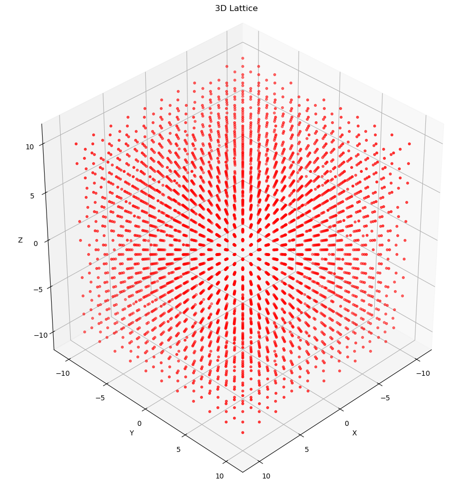
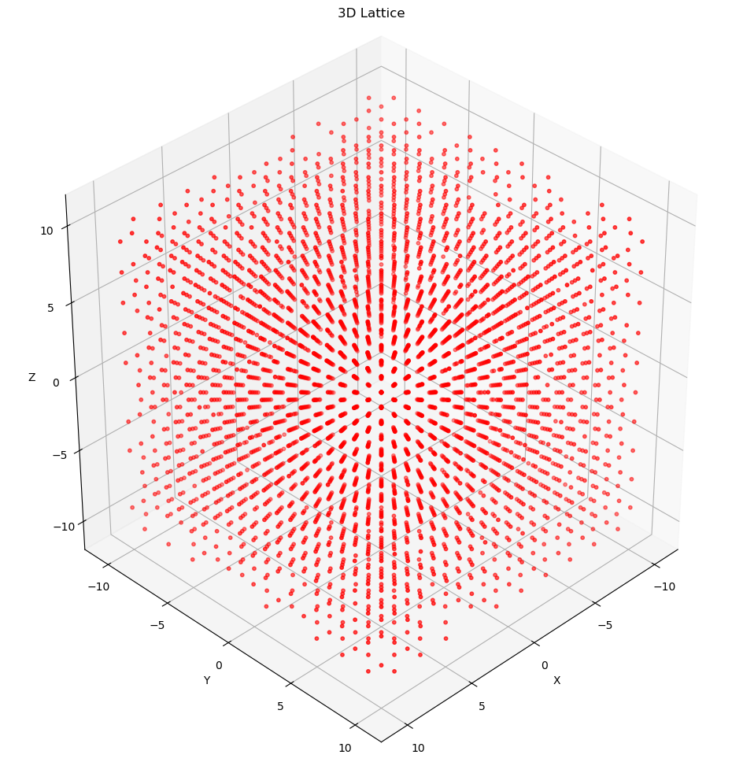
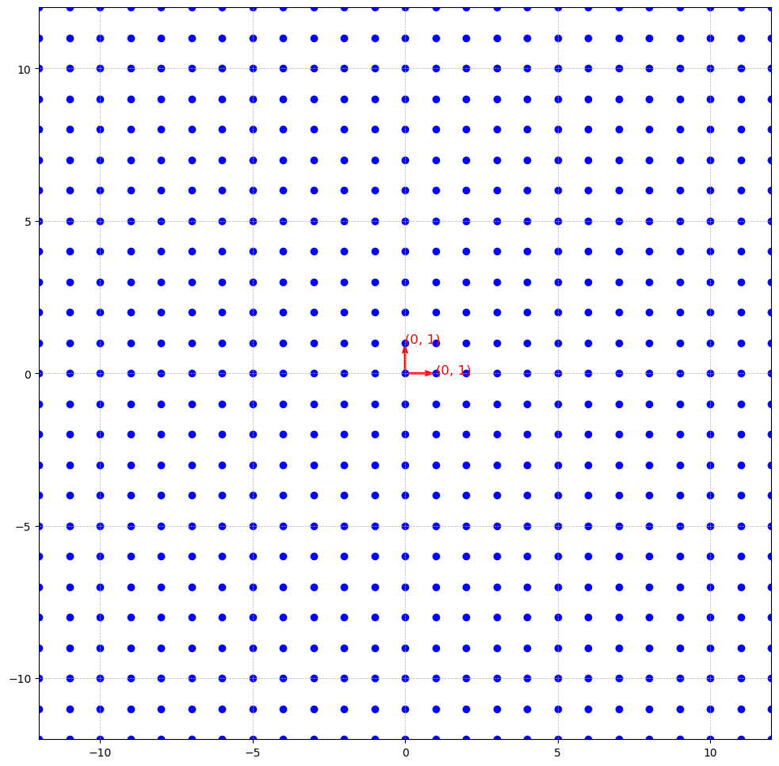

This is the first post in the series: **Introduction to Lattice-based Cryptography**. We focus on lattices as an independent mathematical concept and its properties. However, we focus on aspects that would be useful in the study of Lattice-based Cryptography.

Throughout this series, we use 2-dimensions and 3-dimensions because they are easy to work with. In practice we use sufficiently higher dimensions.

The only prequisite to start this series is to understand the following:

- $\mathbb{R}$ represents the set of all real numbers.
- $\mathbb{Z}$ represents the set of all integers.
- $\mathbb{Q}$ represents the set of all rational numbers.
- $\mathbb{R}^n$ represents the set of all n-dimensional real vectors
- $\mathbb{Z}^n$ represents the set of all n-dimensional integer vectors

## What is a Lattice?

A Lattice $L$ is an infinite set of vectors $\mathbf{v}$ constructed based two condition: **discreteness** and **additivity**.

Formally, an $n$-dimensional *lattice* $L$ is a **discrete additive subgroup** of $\mathbb{R}^n$ generated by a basis $B = \lbrace b_1, b_2, ..., b_n\rbrace$ as an **integer linear combination**: $$L = L(B):= \lbrace\sum_{i = 1}^{n}z_ib_i: z_i \in \mathbb{Z}\rbrace$$

where $z_i$ is an arbitrary integer $\mathbb{Z}$

- **discrete**: This means that every vector point $\mathbf{v} \in L$ has some "neighborhood" in which $\mathbf{v}$ is the only lattice point. Loosely speaking, this means that, for every point $\mathbf{v}$ there is "good space" around it. By using an *integer linear combination* and not just *linear combination* we have achieve reasonable discreteness between vector points. This is shown below using rationals $\mathbb{Q}$ as a counter example.
- **additive subgroup**: a lattice $L$ is an additive subgroup if it contains identity element $0 \in \mathbb{R}^n$(the zero vector), and if for any $\mathbf{v}, \mathbf{w} \in L$, we have $-\mathbf{v}, -\mathbf{w} \in L$ and $\mathbf{v} + \mathbf{w} \in L$

Below, we will see what a lattice is and what it is not.

- The singleton set $\lbrace 0\rbrace \in \mathbb{R}^n$ is a lattice $L$(for any positive integer $n$). That is, the zero vector in any dimension is a lattice.

- The integers $\mathbb{Z} \in \mathbb{R}$ form a 1-dimensional lattice $L$.

- The integer grid $\mathbb{Z}^n \in \mathbb{R}^n$ is an n-dimensional lattice

- The set $\lbrace x ∈ \mathbb{Z}^n : \sum_{i=1}^nx_i ∈ 2\mathbb{Z}\rbrace$ is a lattice; it is often called the “checkerboard” or “chessboard” lattice, especially in two dimensions. It contains all $n$-vectors of integers $x = (x_1, x_2,...,x_n) \in \mathbb{Z}$ such that the sum of the components of $x$, i.e $\sum_{i = 1}^{x_i}$, is an even integer. That is, the sum of elements in the vector is an even integer.

  The opposite is not true. That is $\lbrace x ∈ \mathbb{Z}^n : \sum_{i=1}^nx_i ∈ 2\mathbb{Z} + 1\rbrace$ is not a lattice. Although it is discrete, it is not an additive subgroup of $\mathbb{R}^n$ mainly because it doesn't contain the identity element $0 \in \mathbb{R}^n$(the all-zeros vector) as shown in non-example diagram below. Recall, that a lattice $L$ is an additive subgroup if it contains identity element $0 \in \mathbb{R}^n$, and if any $\mathbf{v}, \mathbf{w} \in L$, we have $-\mathbf{v}, -\mathbf{w} \in L$ and $\mathbf{v} + \mathbf{w} \in L$.

  **Example**: $(0,0),(1,1),(2,4),(−3,5),(−2,−2)$
  
  **Non-example(opposite)**: $(1,0),(2,3),(−1,2)$

- ***Example 1**: Just even integers*

- ***Example 2**: random 2-tuples and 3-tuples with sum of even integer*

- ***Non-example**: random 2-tuples and 3-tuples with sum of odd integer*

- The rationals $\mathbb{Q} \subset \mathbb{R}$ do not form a lattice, because although they form a subgroup, it is not discrete: there exist rational numbers that are arbitrarily close to zero.

  For two arbitrary rational numbers $r_1$ and $r_2$, where $r_1 \lt r_2$ there are inifinitely many rational numbers between them therefore making it impossible for either $r_1$ and $r_2$ to be discrete.

  For example, below is a graph of points in $\mathbb{Q}$ between 1 and 2.

- The odd integers $2\mathbb{Z} + 1$ do not form a lattice, because although they are discrete, they do not form a subgroup of $\mathbb{R}$.

  The odd integers $2\mathbb{Z} + 1$ do not contain 0

---

## Basis

A basis $B = \lbrace b_1, b_2, ..., b_n\rbrace \subset \mathbb{R}^n$ of a lattice $L$ is a set of linearly independent vector whose integer linear combinations generate the lattice:$$L = L(B):= \lbrace\sum_{i = 1}^{n}z_ib_i: z_i \in \mathbb{Z}\rbrace$$

Recall two vectors $b_1$ and $b_2$ are said to be linearly independent if $w_i * b_1 \neq b_2$ and $w_j * b_2 \neq b_1$ where $w_i, w_j$ is an arbitrary integers.

For example, $b_1 = [1, 2, 3]$ and $b_2 = [5, 3, 7]$ are linearly independent while $b_3 = [1, 2, 3]$ and $b_4 = [2, 4, 6]$ are not. Why? $w_1 * b_3 = b_4$ and $w_2 * b_4 = b_3$ where $w_1$ and $w_2$ are $2$ and $\dfrac{1}{2}$ respectively. But, we can't find any $w_i$ for which $w_i * b_1 = b_2$ and vice versa.

In general, the vectors $B = \lbrace b_1, b_2, ..., b_n\rbrace$ are said to be linearly independent if for any vector $b_i$ in the set, it cannot be generated by the linear combination of one, some or all of the other vectors in the set. That is, $c_1b_1 + c_2b_2 + ... + c_mb_m \neq b_i$ where $m$ is an arbitrary natural number.

We can also represent a basis $B$ as a matrix. This is an $n*n$ matrix where the basis vectors are the ordered columns of the matrix. This is a non-singular matrix.

With this we can represent a lattice $L = B * \mathbb{Z}^n = \lbrace Bz: z \in \mathbb{Z}^n \rbrace$

For example, given a basis $B = \lbrace b_1, b_2, b_3\rbrace$ where $b_1 = [1, 0, 0]$, $b_2 = [0, 1, 0]$ and $b_3 = [0, 0, 1]$ respectively, we have a matrix $B = \begin{bmatrix} 1 & 0 & 0\\\\[0.3em] 0 & 1 & 0\\\\[0.3em] 0 & 0 & 1 \end{bmatrix}$ and the finite set of integer vectors $z = \lbrace v_1, v_2, v_3 \rbrace$ where $v_1 = [1, 2, 5]$, $v_2 = [-5, 7, 9]$ and $v_3 = [-9, 3, 7]$ respectively, we can generate a lattice $L$ with three points $[1, 2, 5]$, $[-5, 7, 9]$ and $[-9, 3, 7]$.

This way of representing the basis is instrumental in understanding the next topic: **unimodular matrix**

### Unimodular Matrix

Bases $B_1$, $B_2$ generate the same lattice $L$ if and only if there exists a unimodular $U \in \mathbb{Z}^{n \times n}$ such that $B_1 = B_2U$.

An integer matrix is said to be unimodular if it determinant is $\pm1$.

This property of two bases being able to generate the same lattice $L$ and *some bases been better than others* is what makes lattice-based cryptography possible. We will take about **good and bad bases** below.

We can efficiently test whether two given matrices $B_1$, $B_2$ generate the same lattice, by checking whether $B_1^{-1}·B_2$ is unimodular.

---

## Norms

A *norm* or *vector norm* is a generalization of what we would normally call the *length* or *magnitude* of a vector.

Recall, $||{\mathbf{v}}|| = \sqrt{v_1^2 + v_2^2 + v_3^2 + .... + v_n^2}$, the **magnitude** or **length** or **size** of a vector ${\mathbf{v}}$. This is a type of norm called the **Euclidean norm** $||\mathbf{v}||_2$.

Formally, a norm on a vector space $V$ over $\mathbb{R}$ or $\mathbb{C}$ is a function $||.||:V \to \mathbb{R}$ that satisfies the properties for all vectors $\mathbf{v}$, $\mathbf{w}$ $\in$ $V$ and all scalars $\alpha$:

1. **Non-negativity**: $||\mathbf{v}|| \geq 0$, and $||\mathbf{v}|| = 0 \iff \mathbf{v} = 0$

2. **Homogeneity**: $||\alpha \mathbf{v}|| = |\mathbf{\alpha}|||\mathbf{v}||$

3. **Triangle Inequality**: $||\mathbf{v} + \mathbf{w}|| \leq ||\mathbf{v}|| + ||\mathbf{w}||$

For example, the Euclidean norm for the vector $\mathbf{v} = [3, 4]$ is $||\mathbf{v}||_2 = \sqrt{3^2 + 4^2} = \sqrt{9 + 16} = \sqrt{25} = 5$.

The graphical representation is displayed below. The length of the arrow is $5$.

This graph would help us understand the next topic: ***$i$*-th successive minimum**

Other norms include the *Manhattan Norm*, *Maximum Norm* and *p-norm*. For now, we only care about Euclidean norms.

---

### Successive Minimum

The Euclidean Norm $||\mathbf{v}||_2$ of any vector $\mathbf{v}$ in a lattice $L$ can be interpreted as the **radius** $r$ of a circle (or sphere in higher dimensions) where the origin $(0, 0)$ of the graph is the centre of the circle as shown in the diagram below.

Given a lattice $L$ and a norm(i.e. the Euclidean norm), the $i$-th successive minimum $\lambda_i(L)$ is the smallest radius $r$ such that $L$ contains at least $i$ linearly independent lattice vectors of norm at most $r$ within a ball of radius $r$ centered at the origin.

In other words, what is the smallest radius $r$ such that we can find $i$ linearly independent vectors $\mathbf{v_1}, \mathbf{v_2}, ..., \mathbf{v_i}$ inside the circle(or sphere) with radius $r$? Recall, that we interpret the norm of a vector as a radius $r$ when the centre is at the origin $(0, 0)$.  

For example, if we generate the vectors $\mathbf{v_1} = [4, 2]$, $\mathbf{v_2} = [-5, -5]$ and $\mathbf{v_3} = [2, 11]$ given the basis points $\mathbf{b_1} = [2, 1]$ and $\mathbf{b_2} = [1, 3]$ creating a lattice $L$, what is the 1st successive minimum $\lambda_1(L)$? Or, What is $i$-th successive minimum when $i$ is 1?

We start by finding the norm of the vectors(including the basis vectors):

- $||\mathbf{b_1}||_2 = \sqrt{2^2 + 1^2} = \sqrt{4 + 1} = \sqrt{5} = 2.24$
- $||\mathbf{b_2}||_2 = \sqrt{1^2 + 3^2} = \sqrt{1 + 9} = \sqrt{10} = 3.16$
- $||\mathbf{v_1}||_2 = \sqrt{4^2 + 2^2} = \sqrt{16 + 4} = \sqrt{20} = 4.47$
- $||\mathbf{v_2}||_2 = \sqrt{-5^2 + -5^2} = \sqrt{25 + 25} = \sqrt{50} = 7.07$
- $||\mathbf{v_3}||_2 = \sqrt{2^2 + 11^2} = \sqrt{4 + 121} = \sqrt{125} = 11.18$

The smallest norm is $2.24$ and if we draw a circle using this norm as the radius, we find the linearly independent vector $\mathbf{b_1} = [2, 1]$ within the circle. Therefore, $2.24$ is the the 1st successive minimum.

Notice how it is the closest vector to the origin. It is called the smallest nonzero vector in the lattice. Take note of this, we discuss this later in the series.

### Good and Bad Bases

Given two bases $B_1 = \{ [1, 0], [0, 1] \}$ and $B_2 = \{[10, 1], [9, 1] \}$ that generate the same lattice(see *unimodular matrix* above), below they are labelled on the lattice they generate respectively.

If you are given basis $B_1$ and this lattice, and you are asked to find the first successive minimum $\lambda_{1}$, it's very easy to see that $B_1$ is the answer because it obviously has the smallest norm. But then, what if you are given only $B_2$ and this lattice and you asked to find the first successive minimum $\lambda_1$, how hard could this be?

You can already see that this is a search problem and it gets harder to solve as the dimension increases. This is in two dimensions so it's easy to solve but in practice we work in extremely higher dimensions.

That is the point of good and bad bases. Given a good basis it's easy to find $\lambda_1$ but it's extremely hard to find given a bad basis.

Formally, we check that a basis is good or bad using the following:

- **Good bases are close to being orthogonal**: Two vectors $\mathbf{v}, \mathbf{w}$ are orthogonal if their dot product is zero (i.e $\mathbf{v} . \mathbf{w} = 0$). For example:
  - For $B_1$, $[1, 0].[0, 1] = 0$. This is called **perfect orthogonality**.
  - For $v_1 = [2, 1]$ and $v_2 = [1, 3]$, $v_1.v_2 = 5$. This is not the "best basis" but it's nothing close to a bad basis. Wait until you see that of $B_2$
  - For $B_2$, $[10, 1].[9, 1] = 91$. Now, this is not close to being orthogonal.
- **Bad bases have large Gram-Schmidt Norms**: I won't go into details of Gram-Schmidt Norms but keep this in mind.

Back to understanding successive minimum.

### Successive Minimum (Cont'd)

Again, what is the 2nd successive minimum? We are looking for the smallest radius(i.e norm) that creates a circle containing two linearly independent vectors.

From the computed norms, we know that the second smallest vector is $\mathbf{b_2} = [1, 3]$ with norm of $3.16$. Drawing a circle using this norm as the radius, the circle contains $\mathbf{b_1}$ and $\mathbf{b_2}$. Therefore, $3.16$ is the 2nd successive minimum.

Thirdly, what is the 3rd successive minimum?

Probably $4.47$, the third smallest norm. It turns out this is not the case. They are not linearly independent because $\mathbf{v_1}$ was generated by $b_1$ and $b_2$ therefore there are only two linearly independent vectors(i.e $\mathbf{b_1}$ and $\mathbf{b_2}$) in the circle with radius $4.47$.

How about $7.07$? The fourth smallest norm. This is still not the 3rd successive minimum for the same reason as before, $\mathbf{v_2}$ was generated by $\mathbf{b_1}$ and $\mathbf{b_2}$ therefore the circle with radius $7.07$ contains only two linearly independent vectors.

And, lastly, how about $11.18$? The largest norm. Is it the 3rd successive minimum? No, it's not. For the same reason as before.

With this, it is safe to say the 3rd successive minimum and above does not exist because all other vectors were generated by the basis points $\mathbf{b_1}$ and $\mathbf{b_2}$.

In general, the maximum $i$ in the $i$-th successive minimum is the number of basis vectors.

It's important to point out that a lattice $L$ might have multiple basis vectors and this is an instrumental property of lattices that makes certain types of lattice-based cryptography possible.

---

## Fundamental domains and parallelepipeds

In order to understand fundamental domain and parallelepipeds, here's a quick crash course on abstract algebra.

A **group** is a set $G$ with an operation $*$ that satisfies four properties:

- **Closure**: if $a$, $b \in G$, then $a * b \in G$
- **Associativity**: $(a * b) * c = a * (b * c)$ for all $a, b, c \in G$
- **Identity Element**: There exists an element $i \in G$ such that $i * a = a * i= a$ for all $a \in G$
- **Inverse Element**: For every $a \in G$, there exists an element $a^{-1} \in G$ such that $a * a^{-1} = a^{-1} * a = i$(*the identity element*)

Example of a group:

- The set of integers $\mathbb{Z}$ under the operation, addition $+$ forms a group:
  - **Closure:** if $a, b \in \mathbb{Z}$, then $a + b \in \mathbb{Z}$. For example, $1 + 5 = 6$
  - **Associativity**: $(a + b) + c = a + (b + c)$. For example, $(5 + 3) + 9 = 5 + (3 + 9)$
  - **Identity**: The number $0$ satisfies $0 + a = a + 0 = a$. $0$ is the identity element.
  - **Inverses**: Each $a \in \mathbb{Z}$ has an inverse $-a$, since $a + (-a) = 0$. For example, $3 + (-3) = 0$

A **subgroup** $H$ of a **group** $G$ is a subset of $G$ that is itself a group under the same operation. That is:

- **Closure**: if $a$, $b \in H$, then $a * b \in H$
- **Identity Element**: The identity element of the group $G$ is in $H$
- **Inverse Element**: If $a \in H$, then $a^{-1} \in H$

Example of a subgroup:

- The set of integers divisible by $5$ $5\mathbb{Z} = \lbrace..., -15, -10, -5, 0, 5, 10, 15,...\rbrace$(i.e multipling $5$ by all integers) is a subgroup of $\mathbb{Z}$ under addition because:
  - **Closure:** The sum of two numbers divisible by $5$ is divisible by $5$ making it closed under addition.
  - **Identity**: $0$ is in $5\mathbb{Z}$
  - **Inverses**: Every $a \in 5\mathbb{Z}$ has an inverse $-a$. For example, $10 + (-10) = 0$

**Note**: **Associativity** is automatically holds for subgroups. Ponder on why this is the case.

Let's do a little experiment!

Imagine we added the numbers $0$ to $9$ to the elements in $5\mathbb{Z}$ to create new sets and displayed them in two halves. That is:

First half:

- $\underline{0} = 0 + 5\mathbb{Z} = \lbrace..., -15, -10, -5, 0, 5, 10, 15,...\rbrace$
- $\underline{1} = 1 + 5\mathbb{Z} = \lbrace..., -14, -9, -4, 1, 6, 11, 16,...\rbrace$
- $\underline{2} = 2 + 5\mathbb{Z} = \lbrace..., -13, -8, -3, 2, 7, 12, 17,...\rbrace$
- $\underline{3} = 3 + 5\mathbb{Z} = \lbrace..., -12, -7, -2, 3, 8, 13, 18,...\rbrace$
- $\underline{4} = 4 + 5\mathbb{Z} = \lbrace..., -11, -6, -1, 4, 9, 14, 19,...\rbrace$

Second half:

- $\underline{5} = 5 + 5\mathbb{Z} = \lbrace..., -10, -5, 0, 5, 10, 15, 20,...\rbrace$
- $\underline{6} = 6 + 5\mathbb{Z} = \lbrace..., -9, -4, 1, 6, 11, 16, 21,...\rbrace$
- $\underline{7} = 7 + 5\mathbb{Z} = \lbrace..., -8, -3, 2, 7, 12, 17, 22,...\rbrace$
- $\underline{8} = 8 + 5\mathbb{Z} = \lbrace..., -7, -2, 3, 8, 13, 18, 23,...\rbrace$
- $\underline{9} = 9 + 5\mathbb{Z} = \lbrace..., -6, -1, 4, 9, 14, 19, 24,...\rbrace$

Do you notice anything about these sets!? Here are some observations:

1. The sets in the second half are a repetition of the sets in the first half so we will only focus on the first half moving on. Try creating more sets with numbers greater than $9$ or less than $0$.
2. The sets are disjoint(i.e, they have no elements in common). Every element appears in only one set.
3. The "combination" of the sets makes up the set of integers $\mathbb{Z}$. That is, $\underline{0} \cup \underline{1} \cup \underline{2} \cup \underline{3} \cup \underline{4} = \mathbb{Z}$ where $\cup$ represents union.
4. Each set contains element with the same remainder when divided by $5$. For example, every element in $\underline{2}$ would result in a remainder of $2$ when divided by $5$. These sets are called **equivalent classes** in modulo arithmetic. In this case, they are equivalent because they share the same remainders but equivalence relations can be of different forms as we will see later.
5. If we add any element from a set to any element from another set, you get an element from a set. For example, if we add any number in $\underline{0}$ to any number in $\underline{1}$, we get a number in $\underline{1}$ and if we add any number in $\underline{2}$ to any number in $\underline{4}$, we get a number in $\underline{1}$.
6. If we add any number from a set to any number in $\underline{0}$, we get back a number in the same set. For example, if we add $14$ from $\underline{4}$ to $15$ from $\underline{0}$, we get $4$ from $\underline{4}$.
7. If we add any number from $\underline{2}$ to any number from $\underline{3}$, we get a number from $\underline{0}$, if we add any number from $\underline{1}$ to any number from $\underline{4}$, we get a number from $\underline{0}$ and if we add any number from $\underline{0}$ to any number from itself, we get a number from $\underline{0}$.
8. The last three observations implies **closure**, presence of an **identity element** and presence of an **inverse element** respectively. The sets are called **cosets** and they form a **group** called the **quotient group** $\mathbb{Z}/5\mathbb{Z} = \lbrace\underline{0}, \underline{1}, \underline{2}, \underline{3}, \underline{4}\rbrace$. We call it a quotient group because we use a subgroup to divide the group into cosets. Not all subgroups create cosets that form a quotient group like $5\mathbb{Z}$, but when they do we call them **normal subgroups**. Our observations doesn't show **associativity** but it holds and I urge you to try it out

Formally, a **coset** is formed when you take a subgroup $H$ of a group $G$ and partition $G$ into sets of the form $$gH = \lbrace g * h | h \in H\rbrace$$ where $g \in G$ and $*$ is an operation.

**Note**: The cosets from $\underline{1}$ to $\underline{4}$ are **not** subgroups of $\mathbb{Z}$ under addition. They don't contain the identity element, they are not closed under addition and they don't contain their inverses. Using $\underline{3}$ as an example:

- **identity element**: $0$, the identity element is not in the set.
- **inverse element**: It doesn't contain the identity element so it cannot have an inverse element.
- **closure**: $3 + 8 = 11$ but $11$ is not in $\underline{3}$.

Now, back to lattices. How does all these help in understanding fundamental domain and parallelepipeds?

The above example shows we could take any arbitrary integer $\mathbb{Z}$ and we **must** be able to represent it using one of the elements of the quotient group $\mathbb{Z}/5\mathbb{Z}$. A **fundamental domain** is synonymous to this in lattices.

Since a lattice $L$ is a subgroup of $\mathbb{R}^n$, we can define the quotient group $\mathbb{R}^n/L$, which divides $\mathbb{R}^n$ into cosets of $L$ in $\mathbb{R}^n$. A quotient group $\mathbb{R}^n/L$ of this form corresponds to a fundamental domain of $L$. A fundamental domain is a region in $\mathbb{R}^n$ that contains exactly one representative from each coset just like $\mathbb{Z}/5\mathbb{Z}$. Similar to how $\mathbb{Z}/5\mathbb{Z}$ encompasses the set of integers $\mathbb{Z}$ using five cosets, the fundamental domain encompasses all the elements of $\mathbb{R}^n$ by having a representative for each coset.

Formally, a coset of $L$ in $\mathbb{R}^n$ is a set of the form $m + L = \lbrace m + \lambda | \lambda \in L \rbrace$ where $m$ is a vector in $\mathbb{R}^n$. If $m_1, m_2 \in \mathbb{R}^n$, then $m_1 + L$ and $m_2 + L$ are either the same set or disjoint. The set of all such cosets forms the quotient group $\mathbb{R}^n/L$.

For example, given a lattice $L = \lbrace[5, 2, 1], [2, 1, 3], [4, 5, 1], [7, 2, 1], [10, 7, 7]\rbrace$ and $m_1 = [1.5, 2, 3.3]$, $m_2 = [1, 5.4, 1.1]$ and $m_3 = [1/2, 2.5, 3]$, we can form the following cosets:

- $\underline{m_1} = m_1 + L = [1.5, 2, 3.3] + L = \lbrace[6.5, 4,  4.3], [3.5,  3,  6.3], [5.5,  7,  4.3], [8.5,  4,  4.3], [11.5,  9, 10.3]\rbrace$
- $\underline{m_2} = m_2 + L = [1, 5.4, 1.1] + L = \lbrace[6,  7.4,  2.1], [3,  6.4,  4.1], [5, 10.4,  2.1], [8, 7.4,  2.1], [11, 12.4,  8.1]\rbrace$
- $\underline{m_3} = m_3 + L = [1/2, 2.5, 3] + L = \lbrace[5.5,  4.5,  4], [2.5,  3.5,  6], [4.5,  7.5,  4], [7.5,  4.5,  4], [10.5,  9.5, 10]\rbrace$

An example of a fundamental domain is the set generated by $F = \lbrace t_1v_1 + t_2v_2 + ... + t_nv_n\ : 0 \leq t_i \lt 1 \rbrace$ where $v_1, v_2, ..., v_n$ is the basis of the a lattice and $t_i$ is a real number $\mathbb{R}$ not an integer $\mathbb{Z}$. This fundamental domain is called a **fundamental parallelepiped**.

We are saying that is for any vector $s \in \mathbb{R}^n$, we would be able to find its representative in the fundamental parallelepipeds.

Let's look at an example using basis $v_1 = [2, 1]$ and $v_2 = [1, 3]$.

First, the diagram below shows the lattice generate by this basis.

Next, let's create the fundamental parallelepiped and show it.

As stated above, the fundamental parallelepiped would be generated using $F = \lbrace t_1v_1 + t_2v_2 : 0 \leq t_i \lt 1 \rbrace$. There are infinitely many real numbers in the interval $0 \leq t_i \lt 1$ so we will show generate a few and show more in the diagram.

- $t_1 = 0, t_2 = 0$, then $t_1v_1 + t_2v_2 = 0 * [2, 1] + 0 * [1, 3] = [0, 0]$
- $t_1 = 0, t_2 = 0.1$, then $t_1v_1 + t_2v_2 = 0 * [2, 1] + 0.1 * [1, 3] = [0.1, 0.3]$
- $t_1 = 0.1, t_2 = 0.1$, then $t_1v_1 + t_2v_2 = 0.1 * [2, 1] + 0.1 * [1, 3] = [0.2, 0.1] + [0.1, 0.3] = [0.3, 0.4]$
- $...$
- $t_1 = 0.9, t_2 = 0.9$, then $t_1v_1 + t_2v_2 = 0.9 * [2, 1] + 0.9 * [1, 3] = [1.8, 0.9] + [0.9, 2.7] = [2.7, 3.6]$

That is, the fundamental parallelepiped $F = \lbrace[0, 0], [0.1, 0.3], [0.3, 0.4], ..., [2.7, 3.6]\rbrace$.

Below is the what it looks like on a graph.

Notice how it looks like a scaled down and compressed version of the lattice.

Now, let's verify our claim that we can find a representative of any vector $m \in \mathbb{R}^n$ in the fundamental domain. We will pick $s = [5.2, 6.3]$.

This means that there exists $t_1$ and $t_2$ such that $t_1 * [2, 1] + t_2 * [1, 3] = [5.2, 6.3]$ and we want to find them. Recall that to create an element of an fundamental parallelepiped in $\mathbb{R}^2$ we compute $t_1v_1 + t_2v_2 = s$. Here, we know $s$, we know $v_1$ and $v_2$(the basis) but we don't know $t_1$ and $t_2$ hence we are finding them.

Expanding the expression, we have that $2t_1 + t_2 = 5.2$ and $t_1 + 3t_2 = 6.3$. Solving this we have that $t_1 = 1.86$ and $t_2 = 1.48$(i.e using any of the methods for solving simultaneous equations like gaussian elimination).

Recall that $t_1$ and $t_2$ are supposed to be in the interval $0 \leq t_i \lt 1$. We would have to wrap $t_1$ and $t_2$ around this interval. In other words, we would have to compute $t_1 \% 1$ and $t_2 \% 1$. Doing that we have that $t_1 = 0.86$ and $t_2 = 0.48$.

To get to representative $r$ of $s$ in the fundamental parallelepiped, we compute $r = t_1v_1 + t_2v_2 = 0.86 * [2, 1] + 0.48 * [1, 3] = [1.72, 0.86] + [0.48, 1.44] = [2.2, 2.3]$. Therefore, $r = [2.2, 2.3]$ is the representative of $s = [5.2, 6.3]$ in the fundamental parallelepiped.

We are not done yet.

Do you see any similarity between $r$ and $m$? You would notice they both end in the same decimals $.2$ and $.3$. That means their difference is an integer vector. That is, $s - r = [5.2, 6.3] - [2.2, 2.3] = [3, 4]$.

Using our basis $v_1 = [2, 1]$ and $v_2 = [1, 3]$, we can generate the lattice: $$L = \lbrace[2, 1], [1, 3], [-2 -11], [3, 4], [-11, -13], [9, 7], [1, 8], [4, 7], [-5, -10], [8, 9]\rbrace$$
Recall that, a coset of $L$ in $\mathbb{R}^n$ is a set of the form $m + L = \lbrace m + \lambda | \lambda \in L \rbrace$. Setting $r = m$, we have that: $$r + L = [2.2, 2.3] + L = \lbrace[4.2,   3.3],[3.2, 5.3], [0.2,  -8.7], [5.2,   6.3], [-8.8, -10.7], [11.2,   9.3], [3.2,  10.3], [6.2,   9.3], [-2.8,  -7.7], [10.2,  11.3]\rbrace$$
Notice how $[3, 4]$ is part of the lattice $L$ and $[5.2, 6.3]$ is part of the coset $r + L$.

This shows that every vector in this coset has the representative $[2.2, 2.3]$ in the fundamental parallelepiped and this is their equivalence relation.

Lastly, note that **a fundamental domain is not a lattice**.

---

The goal of this material was to introduce these concepts independently; appreciating their beauty without drawing parallels to their applications in lattice-based cryptography; we will do that in the other posts in this series.

In the next post, we will be looking into *Hard Problems in Lattice-Based Cryptography*. See you there!
